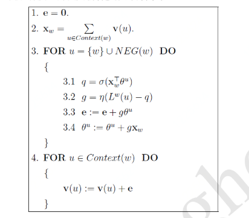

#              Word2Vec与Word Embedding

Li Junli 李军利

Apr 15 2019

## 1. 简介

### 1.1.1 Word Embedding

​	词向量（Word embedding），又叫词嵌入式，是NLP 中的一组语言建模和特征学习技术的统称，是单词或短语被映射到实数的向量，One-Hot编码是最简单的向量表示形式。 从概念上讲，它涉及从每个单词一维的空间到具有更低维度的连续向量空间的数学嵌入。生成这种映射的方法包括神经网络、单词共生矩阵的降维、概率模型、可解释的知识库方法、术语的显式表示单词出现的背景。

​	总的来说，word embedding就是一个词的低维向量表示（一般用的维度可以是几十到几千）。有了一个词的向量之后，各种基于向量的计算就可以实施，如用向量之间的相似度来度量词之间的语义相关性。当用作底层输入表示时，单词和短语嵌入已经被证明可以提高NLP任务的性能，例如语法分析和情感分析。

### 1.1.2 Word2Vec

​	2013年，Google开源了一款用于词向量计算的工具——word2vec，是Word Embedding的一种。		

​	Word2vec，是一群用来产生词向量的相关模型，这些模型为浅而双层的神经网络，可以根据给定的语料库，通过优化后的训练模型快速有效地将一个词语表达成向量形式，为自然语言处理领域的应用研究提供了新的工具。Word2vec依赖skip-grams或CBOW来建立神经词嵌入，训练完成后，word2vec模型可用来映射每个词到一个向量，可用来表示词对词之间的关系，该向量为神经网络的隐藏层。

## 2 预备知识

### 2.1 Sigmoid函数

​	sigmoid函数是神经网络中常用的一个激活函数，公式：
$$
\sigma=\frac{1}{1+e^{-x}}，Ｘ\epsilon(-\infty,+\infty)，Y\epsilon(0,1)
$$

​	sigmoid 的导函数具有形式：
$$
\sigma'(x)=\sigma(x)[1-\sigma(x)]
$$
​	易得对数形式的导函数：
$$
[log\sigma(x)]'=1-\sigma(x)，[log(1-\sigma(x))]'=-\sigma(x)
$$

### 2.2 Logistic 回归

​	Logistic回归: sigmoid函数作用在线性回归上将回归问题转化成分类问题。

​	详细内容可参考**回归算法**一文中的相关部分，此处不再赘述。

### 2.3 Bayes公式

​	贝叶斯公式描述的是两个条件概率之间的关系。

​	
$$
条件概率：P(A|B) = \frac{P(A,B)}{P(B)}，P(A|B) = \frac{P(B,A)}{P(A)}
$$
​	根据上式得Bayes公式：
$$
P(A|B) = P(A)\frac{P(B|A)}{P(B)}
$$
​	其中P(B)也可以进一步表示为全概率形式，**朴素贝叶斯算法**一文有具体的应用场景。

### 2.4 Humman编码

​	了解Huffman编码，首先要了解Huffman树[6]。

#### 2.4.1 树

​	计算机科学中，树是一种非常重要的非线性数据结构，它是数据元素（树中叫做结点）按分支关系组织起来的结构，若干棵互不相交的树所构成的集合称之为森林，下面给出几个与树相关的常见概念：

​	**路径和路径长度：**

​	在一颗树中，从一个结点往下可以达到的孩子或孙子结点之间的通路，称为路径。

​	通路中分支的数目称为路径长度。若规定根结点的层号为*1*，则从根结点到第*L*层结点的路径长度为 *L-1*。

​	**结点的权和带权路径长度：**

​	若为树中结点赋予一个具有某种含义的非负数值，则这个数值称为该结点的权。

​	结点的带权路径长度是指：从根结点到该结点之间的路径长度与该结点的权的乘积。

​	**树的带权路径长度：**

​	树的带权路径长度规定为所有叶子结点的带权路径长度之和。

#### 2.4.2 Humman树

​	二叉树是每个结点最多有两颗子树的有序树，两个子树通常称为**左子树**和**右子树**，定义中的有序是指两个子树有左右之分，顺序不能颠倒。

​	给定*n*个权值作为*n*个叶子结点构造一颗二叉树，若它的带权路径长度达到最小，则称这样的二叉树为**最优二叉树**，也称为**Humman**树。

​	给定*n*个权值{w1, w2, ..., wn}，构造**Humman**树：

​     （1） 将{w1, w2, ..., wn}看出是有n棵树的森林（每棵树仅有一个结点）

​     （2） 在森林中选两个根结点的权值最小的树合并，作为一颗新树的左右子树，且新树的根结点权值为其左右

​                子树的根结点权值之和

​     （3） 从森林中删除已选择的两颗树，并将新树加入森林

​     （4） 重复（2）（3）步，直到森林中只剩一颗树为止，该树即为所求的Humman树

​	

​	我最爱的NBA季后赛昨天拉开了帷幕，就以此为例，构造一个Humman树吧[5]，假设我今天在虎扑NBA论坛爬取了一个帖子，"火箭"，"雷霆"，"开拓者"，"雄鹿"，"杜兰特"，"威少"这6个词在帖子里出现的次数分布是15，8，6，5，3，1。以这6个词为结点，以词频为权值，构造一颗Humman树：

​	树中，词频越大的词离根结点越近。构造过程中，通过合并新增的结点标记为黄色。由于每两个结点都要进行一次合并，因此，当叶子结点为n时，Humman树新增的叶子结点为n-1。另外，二叉树是分左右的，本例中，统一将词频大的结点作为左孩子结点。

#### 2.4.3 编码

​	在数据通信中，需要将传送的文字转换成二进制的字符串，用0，1码的不同排列来表示字符。例如需要POST的报文是"AFTER DATA EAR ARE ART AREA"，此时用到的字符集是 A、E、R、T、F、D，各字母出现次数是       8、4、5、3、1、1，现要求为这些字符涉及编码。

​	要区分6个字母，最简单的二进制编码方式是等长编码，固定采用3位二进制（2^3=8>6)，可分别用        000，001， 010，011，100，101 对 A、E、R、T、F、D 进行编码发送，对方接到报文时，再按照3位一分进行破译。显然编码的长度取决于报文中不同字符的次数，若报文出现26个不同字符，则固定编码长度为5（2^5=32>26)。然而传送报文时总希望长度尽可能短，在实际应用中，各个字符的出现频率是不同的，如果A、B、C的使用频率远高于X、Y、Z，自然让频率高的字符使用短码，频率低的字符使用长码，以优化整个报文编码。

​	为使**不等长编码** 为前缀编码（即要求一个字符的编码不能是另一个字符编码的前缀）

​	可用字符集中的每个字符作为叶子结点生成一颗编码二叉树，为了获得传送报文的最短长度，将每个字符的频率作为结点的权值，频率小，编码长，频率高，编码短，这样就保证了次数的最小带权路径长度效果上就是传送报文的最短长度。因此求报文的最短长度问题转化为求Humman树问题，利用Humman树设计的二进制前缀编码称为Humman编码，它既能满足满足前缀编码的条件，又能保证报文编码总长度最短。

​	本文的Word2Vec也将用到Humman编码，它把训练语料中的词当做叶子结点，其在语料中出现的次数当做权值，通过构造相应的Humman树来对每一个词进行Humman编码[5]。

​	上面NBA例子的Humman编码：

​	约定词频大的左孩子结点编码为1，右孩子编码为0。6个词的编码分别是 0、111、110、101、1001、1000.

​	本文关于Humman树和Humman编码有两个约定：一是将权值大的点作为左孩子结点，二是左孩子结点编码为1。Word2Vec源码中同样将权值交大的孩子结点编码为1，下文如果提到左孩子结点都是指权值较大的孩子结点。

## 3. 语言模型

​	Word2Vec是用来生成词向量的工具，词向量与语言模型关系密切，先介绍几个语言模型。

### 3.1 统计语言模型介绍

​	如今，各种网站、平台、APP 每天都在产生无数的文本、图片、语言、视频等数据，要对这些数据进行处理并从中挖掘有价值的信息，离不开自然语言处理（Natual Language Processing, NLP）技术，统计语言模型（Statistical Language Model) 是NLP的重要一环，是所有NLP技术的基础，被广泛用于语音识别、机器翻译、分词、词性标注和信息检索等任务。

​	在语音识别系统中，对给定的语音段Voice，需要找到一个使概率**P(Text|Voice)** 最大的文本段，利用Bayes公式，有：
$$
P(Text|Voice) = \frac{P(Text)P(Voice|Text)}{P(Voice)}
$$
​	P(Voice|Text)称为**声学模型**，P(Text)为语言模型。

​	简单地说，统计语言模型是用来计算一个句子的**概率模型**，它通常基于一个语料库来构建。
$$
假设W=w_1^T:=(w_1,w_2,...,W_T)表示由T个词顺序组成的一个句子，则w_1,w_2,...,w_T的联合概率：
$$

$$
P(W)=P(w_1^T)=P(w_1,w_2,...,W_T)就是句子W的概率。
$$

​	将上式链式分解为：
$$
P(w_1^T)=P(w_1)\cdot P(w_2|w_1)\cdot P(w_3|w_1^2)  ...  P(w_T|w_1^{T-1})
$$

$$
其中的（条件）概率 P(w_1),P(w_2|w_1),P(w_3|w_1^2)...,P(w_T|w_1^{T-1})是语言模型的参数
$$

 	求出全部参数时，句子的概率也就计算出来了，看似简单，但难点在于计算复杂度。假设某个句子的长度为*T*，则需要计算*T*个参数。若语料库对应词典*D*的大小（即词汇量）为*N*，如果句子长度为*T*，理论上就有*N^T* 种可能，每种可能需要计算*T*个参数，共需要计算*TN^T* 个参数。当然这里只是简单估算，没有考虑重复参数，但是量级非常吓人。概率计算完成后，保存这些信息也需要很大的内存开销。

​	计算这些参数的常见方法有：n-gram模型、决策树、最大熵模型、最大熵马尔科夫模型、条件随机场、神经网络等，本文讨论**n-gram**模型和**神经网络**两者方法。

### 3.2 n-gram模型

$$
考虑P(w_k|w_1^{k-1})(k>1)的近似计算，用Bayes公式有：
$$

$$
P(w_k|w_1^{k-1})=\frac{P(w_k) \cdot P(w_1^{k-1})}{P(w_1^{k-1})}=\frac{P(w_1^k)}{P(w_1^{k-1})}
$$

$$
根据大数定律，当语料库足够大时，P(w_k|w_1^{k-1})\approx \frac{count(w_1^k)}{count(w_1^{k-1})}
$$

​	当k很大时，count()统计非常耗时，公式中一个词出现的概率与它前面的所有词都相关，如果假定一个词出现的概率只与它前面的固定个数的词相关，计算量会大大减少，这就是**n-gram** 模型思想，它作了一个**n-1**阶的**Markov** 假设，认为一个词出现的概率只与它前面的n个词相关，即：
$$
P(w_k|w_1^{k-1})\approx P(w_k|w_{k-n+1}^{k-1})\approx \frac{count(w_{k-n+1}^k)}{count(w_{k-n+1}^{k-1})}
$$
​	n = 2时：
$$
P(w_k|w_1^{k-1})\approx \frac{count(w_{k-1},w_k)}{count(w_{k-1})}
$$
​	这样简化后，单个参数的统计效率大大提高，参数总数也大大减少。

​	下表给出了随着n的增大，模型参数数量的变化：

| n           | 模型参数数量 |
| :---------- | ------------ |
| 1 (unigram) | 2 * 10^5     |
| 2 bigram)   | 4 * 10^10    |
| 3 (trigram) | 8 * 10^15    |
| 4 (4-gram)  | 16 * 10^20   |

​	假定词典大小为200000，汉语的词汇量大概是这个量级。实际上，模型参数的量级是N的指数函数 **O(N^n)**，显然n不能取得太大，实际应用中使用最多的是三元模型 n = 3。

​	在模型效果方面，理论上n越大，效果越好，现如今，互联网的海量数据以及机器性能的提升使得计算更高阶的语言模型（n>10）成为可能，但需要注意的是，当n大到一定程度时，模型效果的提升幅度会减少，类似经济学中的边际效应。事实上，这里还涉及到一个可靠性和可区分性的问题，参数越多，可区别性越好，但同时单个参数的实例变少，降低可靠性，因此需要在可靠性和可区分性之间进行折中。

​	另外，n-gram模型中还有一一个叫做**平滑化**的重要环节，考虑两个问题：
$$
若 count(w_{k-n+1}^k)=0，能否认为P(w_k|w_1^{k-1})=0？
$$

$$
若 count(w_{k-n+1}^k)=count(w_{k-n+1}^{k-1})，能否认为P(w_k|w_1^{k-1})=1？
$$

​	显然值等于0或1是不合理的，不管语料库多大，这都是一个不可回避的问题，平滑化技术就是用来处理这个问题的[12]。

​	总结起来，n-gram模型是这样一种模型，其主要工作是在语料中统计各种词串出现的次数以及平滑化处理。概率值计算好之后就存储起来，下次需要计算一个句子的概率时，只需找到相关的概率参数,将它们连乘起来就好了。然而，在机器学习领域有一种通用的招数是这样的：对所考虑的问题建模后先为其构造一个目标函数,然后对这个目标函数进行优化，从而求得一-组最优的参数,最后利用这组最优参数对应的模型来进行预测。

 	 对于统计语言模型而言，利用最大似然可把目标函数设为：
$$
\prod_{w\epsilon C}{P(w|Context(w))}
$$
​	公式中，C表示语料（Corpus），Context(w)表示词的上下文（Context），即w周边词的集合，当Context(w)为空时，就取P(w|Context(w)) = P(w)，特别地，对于n-gram模型：
$$
Context(w_i) = w_{i-n+1}^{i-1}
$$

​	注意：语料C和词典D的区别——

​                   词典D是从语料C中抽取出来的，不存在重复的词；而语料C是指所有的文本内容，包括重复的词。

​	当然，实际应用中常采用最大对数似然，即把目标函数设为：
$$
Loss = \sum_{w\epsilon C}log(P(w|Context(w)))
$$
​	概率P(w|Context(w))视为关于w和Context(w)的函数，即：
$$
P(w|Context(w))=F(w,Context(w),\theta)，\theta为待定参数集
$$
​	通过使得目标函数Loss达到最大，得到最优参数集θ\*，F也就唯一确定了，以后任何概率P(w|Context(w))就可以通过函数F(w, Context(w), θ\*)来计算了。与n-gram相比，这种方法不需要事先计算并保存所有的概率值，而是通过直接计算来获取，且通过选取合适的模型可使得θ中参数的个数远小于n-gram模型中参数的个数。

​	此方法最关键的是F函数的构造，下一小节将介绍一-种通过神经网络来构造F函数的方法。之所以特意介绍这个方法，是因为它可以视为word2vec中算法框架的前身或者说基础。

### 3.3 神经概率语言模型

​	神经概率语言模型是 **Bengio** [8]等人于2003年提出的，该模型用到了本文的核心——**词向量**。顾名思义，神经概率语言模型是一个神经网络模型，包括4个层**输入**(Input)、**投影**(Projection)、**隐藏**(Hidden)、**输出**(Output)。 

结构示意图：

​	其中，W、U分别为投影层和隐藏层、隐藏层和输出层之间的权值矩阵，p、q是隐藏层和输出层上的偏置向量

​	一般地，人们将其视为下图的3层结构，本文将其描述为4层结构，便于和word2vec中使用的网络结构作对比

​	作者在文[8]中还考虑了投影层和输出层的神经元之间有边相连的情形，因而也会多出一个相应的权值矩阵，本文忽略了这种情形，但这并不影响对算法本质的理解。在数值实验中，作者发现引入投影层和输出层之间的权值矩阵虽然不能提高模型效果，但可以减少训练的迭代次数。

​	对于语料C中的任意一个词w，将Context(w)取为其前面的n-1个词(类似于n-gram)，这样二元对   (Context(w), w)就是一个训练样本。接下来，讨论样本(Context(w), w)经过如上图所示的神经网络时是如何参与运算的。需要注意，一旦语料C和词向量长度m给定后，投影层和输出层的规模就确定了，前者为(n- 1)m,后者为N= |D| 即语料C的词汇量大小。
$$
隐藏层的规模n_h是我们指定的可调参数
$$
​	为什么投影层的规模是(n- 1)m呢? 输入层包含Context(w) 中n- 1个词的词向量，而投影层的向量Xw是这样构造的——将输入层的n-1个词向量按顺序首尾相接地拼起来形成一个长向量，其长度当然是(n-1)m。

​	有了向量Xw，接下来的计算过程比较简单，具体为：
$$
z_w=tanh(W_{x_w}+p)
$$

$$
y_w=U_{z_w}+q
$$

​	tanh是双曲正切函数，用来作隐藏层的**激活函数**，公式中tanh作用在向量上表示它作用在向量的每一个分量上。tanh函数曲线如图：

​	对于语料中的一个给定句子的前几个词，其前面的词不足n-1个怎么办? 此时，可以人为地添加一个(或几个)填充向量就可以了，它们也参与训练过程。

​	经过上述两个公式计算得到的
$$
y_w=(y_{w,1},y_{w,2},...,y_{w,N})^T
$$
​	只是一一个长度为N的向量，其分量不能表示概率。将分量表示成：当上下文为Context(w)时下一个词恰为词典D中第i个词的概率，则还需要做一一个 **softmax**归-化，归-化后，p(w|Context(w)) 就可以表示为:
$$
P(w|Context(w))=\frac{e^{y_w,i_w}}{\sum_{i=1}^{N}e^{y_w,i}}，ｉ_w表示词W在词典D中的索引
$$
​	公式给出了概率p(w|Context(w))的函数表示，即找到了上一小节中提到的函数F(w, Context(w), θ)，那么其中待确定的参数θ有哪些呢? 总结起来，包括两部分：
$$
●词向量: v(w)∈R^m,w∈D以及填充向量.
$$

$$
●神经网络参数: W∈R^{n_h*(n-1)m},p∈R^{n_h},U∈R^{N*n_h},q∈R^N
$$

​	这些参数均通过训练算法得到，值得一提的是，通常的机器学习算法中，输入都是已知的，而在上述神经概率语言模型中，输入v(w)也需要通过训练才能得到。 接下来，简要地分析一下，上述模型的运算量，神经网络结构中，投影层、隐藏层和输出层的规模分别为(n- 1)m, n, N，依次看看其中涉及的参数:
$$
● n是一个词的上下文中包含的词数，通常不超过5
$$

$$
●m是词向量长度,通常是10^1-10^2量级
$$

$$
●n_h事先指定，通常不需取得太大，如10^2量级
$$

$$
●N是语料词汇量的大小，与语料相关，但通常是10^4-10^5量级
$$

​	根据公式和参数，整个模型的大部分计算集中在隐藏层和输出层之间的矩阵向量运算，以及输出层上的**softmax**归一化运算。因此后续的优化主要针对这一部分，其中就包括了word2vec 的工作。

​	 与n-gram模型相比，神经概率语言模型有以下两点优势：

 1. 词语之间的相似性可以通过词向量来体现

    举例来说，如果某个(英语)语料中S1 = "A dog is running in the room" 出现了10000次，而S2="A cat is running in the room"只出现了1次。按照n-gram模型的做法，P(S1)肯定会远大于P(S2)。但是，S1和S2的唯一区别在于dog和cat，而这两个词无论是句法还是语义上都扮演了相同的角色，因此，P(S1)和P(S2)应该很相近才对。由神经概率语言模型算得的P(S1) 和P(S2)是大致相等的，原因在于: 

    (1) 在神经概率语言模型中假定了“相似的”的词对应的词向量也是相似的;

    (2) 概率函数关于词向量是光滑的，即词向量中的一个小变化对概率的影响也只是一个小变化。这样一来，对 

    ​     于下面句子：

    ​     A dog is running in the room

    ​     A cat is running in the room

    ​     The cat is running in a room

    ​     A dog is walking in a bedroom

    ​     The dog was walking in the room

    ​     只要在语料库中出现其中一个句子，其他相似句子的概率也会相应地增大。

	2. 基于词向量的模型自带平滑化功能(由Softmax公式知，P(w|Context(w))∈(0,1)不会为零) 

    因此，不再需要像n-gram那样进行额外平滑处理了。

​	最后，回想一下，词向量在整个神经概率语言模型中扮演了什么角色呢? 训练时，它是用来帮助构造目标函数的辅助参数，训练完成后，它也好像只是语言模型的一个副产品。虽然起初词向量只是神经概率语言模型的副产品，但现如今，这个副产品越来越重要，可以作为预训练的词向量，很多情况下我们训练算法，只是为了得到这个副产品。下一节将对词向量这个副产品作进一步阐述。

### 3.4 词向量的理解

​	在NLP任务中，我们将自然语言交给机器学习算法来处理，但机器无法直接理解人类的语言，因此首先要做的事情就是将语言数学化，词向量提供了一一种很好的数学化方式。

​      一种最简单的词向量是one-hot representation, 就是用一个很长的向量来表示一个词，向量的长度为词典D的大小N，向量的分量只有一个1，其它全为0。1的位置对应该词在词典中的索引，但这种词向量表示容易受维数灾难的困扰，尤其是将其用于Deep Learning 场景时;而且它不能很好地刻画词与词之间的相似性。

​	另一种词向量是Distributed Representation, 它最早是Hinton[7] 于1986 年提出的，可以克服one-hot 的上述缺点。其基本想法是：通过训练将某种语言中的每一个词映射成一一个固定长度的短向量(当然这里的“短”是相对于one-hot 的“长”而言的)，所有这些向量构成一个词向量空间，而每一向量则可视为该空间中的一一个点，在这个空间上引入“距离”，就可以根据词之间的距离来判断它们之间的(词法、语义上的)相似性了。word2vec中采用的就是这种Distributed Representation的词向量。

​	为什么叫做Distributed Representation? 个人理解是这样的：对于one-hot representation, 向量中只有一个非零分量，非常集中(有点孤注一掷的感觉)；而对于Distributed Representation, 向量中有大量非零分量，相对分散(有点风险平摊的感觉)，把词的信息分布到各个分量中去了。这一点，跟并行计算里的分布式并行很像。

​	为更好地理解上述思想，举-一个通俗的例子：

​	假设在二维平面上分布有n个不同的点，给定其中的某个点，现在想在平面上找到与这个点最相近的一个点。

​	首先，建立一个直角坐标系，基于该坐标系，其上的每个点就唯一地对应一个坐标(x, y)；

​	接着引入欧氏距离；

​	最后分别计算这个点与其他 n-1 个点之间的距离，对应最小距离值的那个(或那些) 点便是我们要找的点了。

​	上面的例子中，坐标(x, y)的地位就相当于词向量，它用来将平面上-一个点的位置在数学上作量化。坐标系建立好以后，要得到某个点的坐标是很容易的。然而，在NLP任务中，要得到词向量就复杂得多了，而且词向量并不唯一，其质量依赖于训练语料、训练算法等因素。

​	如何获取词向量呢? 有很多不同模型可用来估计词向量，包括有名的LSA(LatentSe-mantic Analysis)和      LDA (Latent Dirichlet Allocation)。此外，利用神经网络算法也是一种常用的方法，上一小节介绍的神经概率语言模型就是-一个很好的实例。当然，在那个模型中，目标是生成语言模型，词向量只是一个副产品。事实上，大部分情况下，词向量和语言模型都是捆绑在一起的，训练完成后两者同时得到。用神经网络来训练语言模型的思想最早由百度深度学习研究院的徐伟[13]提出。这方面最经典的文章要数 Bengio 于2003年发表在 JMLR 上的           《A Neural Probabilistic Language Model》，其后有一系列相关的研究，其中也包括谷歌Tomas Mikolov团队的word2vec。

​	一份好的词向量是很有价值的，例如，Ronan Collobert团队在软件包SENNA [14]中利用词向量进行了POS、CHK、NER等任务，且取得了不错的效果，如下图：

​	看到的词向量在机器翻译领域的一个应用报道[15]:

​	谷歌的Tomas Mikolov团队开发了一种词典和术语表的自动生成技术，能够把一种语言转变成另一种语言。该技术利用数据挖掘来构建两种语言的结构模型，然后 加以对比每种语言词语之间的关系集合即“语言空间”，可以被表征为数学意义上的向量集合。在向量空间内，不同的语言享有许多共性，只要实现一个向量空间向另一个向量空间的映射和转换，语言翻译即可实现。该技术效果非常不错,对英语和西语间的翻译准确率高达90%.

​	考虑英语和西班牙语两种语言，通过训练分别得到它们对应的词向量空间E(nglish) 和S(panish)。从英语中取出五个词one, two, three, four, five, 设其在E中对应的词向量分别为u1, u2, u3, u4,u5,为方便作图，利用主成分分析(PCA) 降维，得到相应的二维向量v1,v2, v3,v4,v5，在二维平面上将这五个点描出来，如下图左侧所示

​	类似地，在西班牙语中取出(与one, two, three, four, five 对应的) uno, dos, tres, cuatro,cinco，设其在S中对应的词向量分别为s1,s2,s3,s4,s5， 用PCA降维后的二维向量分别为t1,t2, t3, t4, t5，将它们在二维平面上描出来(可能还需作适当的旋转),如下图右侧所示。

​	观察左、右两幅图，容易发现：五个词在两个向量空间中的相对位置差不多，这说明两种不同语言对应向量空间的结构之间具有相似性，从而进一步说明了在词向量空间中利用距离刻画词之间相似性的合理性。

​	注意，词向量只是针对“词”来提的，事实上，我们也可以针对更细粒度或更粗粒度来进行推广，如字向量[15],句子向量和文档向量[16]， 它们能为字、句子、文档等单元提供更好的表示。

## 4. Word2Vec 模型框架

​	有了前面的准备，本节开始正式介绍Word2Vec中用到的两个重要模型——CBOW 模型(Continuous Bag-of- Words Model)和Skip gram模型(Contimuous Skip-gram Model)。关于这两个模型，作者Tomas Mikolov[11]   给出了如 图8、图9 的示意图：

​	由图可见，两个模型都包含三层：输入层、投影层和输出层。
$$
CBOW：已知上下文w_{t-2},w_{t-1},w_{t+1},w_{t+2}的情况下预测当前词w_t
$$

$$
Skip-gram：已知当前词w_t的情况下预测上下文w_{t-2},w_{t-1},w_{t+1},w_{t+2}
$$

​	对于CBOW和Skip-gram 两个模型，word2vec给出了两套框架，它们分别基于**Hier-archical Softmax**和**Negative Sampling**来进行设计。

### 4.1 基于Hier-archical Softmax

​	3.2 一节中提到，基于神经网络的语言模型的目标函数通常表示为对数似然函数：
$$
CBOW:Loss = \sum_{w\epsilon C}log(P(w|Context(w)))
$$
​	其中的关键是条件概率函数P(w|Context(w))的构造：
$$
P(w|Context(w))=\frac{e^{y_w,i_w}}{\sum_{i=1}^{N}e^{y_w,i}}，ｉ_w表示词W在词典D中的索引
$$
​	对于Skip-gram则有：
$$
Skip-gram:Loss = \sum_{w\epsilon C}log(P(Context(w)|w))
$$
​	本文的重点在于P(w|Context(w))或P(Context(w)w)的构造上，接下来从数学角度对这两个模型作详细介绍。

#### 4.1.1 CBOW

​	本小节介绍Word2Vec的第一个模型CBOW。

##### 网络结构	

​	下图给出了CBOW模型的网络结构，它包括三层:输入层、投影层和输出层。

​	以 样本(Context(w), w)为例(这里假设Context(w)由w前后各c个词构成)，对这三个层做简要说明：

1. 输入层：包含Context(w)中2c个词的词向量，m是词向量的长度

$$
v(Context(w)_1),v(Context(w)_2),...,v(Context(w)_{2c})\epsilon R^m
$$

2. 投影层：将输入层2c个向量作求和累加，即

$$
x_w=\sum_{i=1}^{2c}v(Context(w)_i)\epsilon R^m输出层：
$$

                3. 输出层：输出层对应一棵二叉树，它是以语料中出现过的词当叶子结点，以各词在语料中出现的次数当权值构造出来的Hufman树。在这棵Hufman树中，叶子结点共N =|D|个,分别对应词典D中的词，非叶子结点N - 1个(图中标成黄色的那些结点)。对比3.3小节中神经既率语言模型的网络图和CBOW模型的结构图，易知它们主要有以下三处不同:

​     （1）(从输入层到投影层的操作)前者是通过拼接，后者通过累加求和

​     （2）(隐藏层)前者有隐藏层，后者无隐藏层

​     （3）(输出层)前者是线性结构，后者是树形结构

​	3.3介绍的神经概率语言模型中，模型的大部分计算集中在隐藏层和输出层之间的矩阵向量运算，以及输出层上的**softmax**归一化运算。而从上面的对比中可见，**CBOW**模型对这些计算复杂度高的地方有针对性地进行了改变，首先，去掉了隐藏层，其次，输出层改用了**Huffiman** 树,从而为利用Hierarchical softmax技术奠定了基础。

##### 梯度计算

​	**Hierarchical Softmax**是Word2Vec中用于提高性能的一项关键技术，为描述方便起见，在具体介绍这个技术之前，先引入若干相关记号，考虑Huffman树中的某个叶子结点，假设它对应词典D中的词w，记

1.  pw :  从根结点出发到达w对应叶子结点的路径；

2.  lw  :  路径 pw中包含结点的个数；

3.  
$$
   p_1^w, p_2^w,..., p_{l_w}^w：路径p_w中的l^w个结点，其中p_1^w表示根结点，p_{l_w}^w表示词w对应的结点
$$

4. $$
   d_2^w, d_3^w,..., d_{l_w}^w \epsilon (0, 1):词w的Humman编码，它由l_w^{w}-1位编码组成，
   $$

$$
d_j^w表示路径p^w中第j个结点对应的编码（根结点不对应编码）
$$

5. $$
   θ_1^w, θ_2^w,..., θ_{l_w-1}^w\epsilon R^m：路径p_w中非叶子结点对应的向量，θ_j^w表示路径p^w中第j个非叶子结点对应的向量
   $$

​	按理说，我们要求的是词典D中每个词(即Hufrman树中所有叶子节点)的向量，为什么这里还要为Huffman树中每一个非叶子结点也定义一个同长的向量呢?  事实上，它们只是算法中的辅助向量，具体用途在下文解释。

​	引入了一大堆抽象的记号，接下来，还是通过一个简单的例子把它们落到实处，如下图, 仍以预备知识中例2.4.3 NBA季后赛为例，（*哈哈，提一句，今天中午看到我支持的勇士队领先31分被逆转，创造了季后赛被逆转的历史记录，杜兰特应该背锅，就选这个词吧*）考虑词w = "杜兰特"的情形（依然改编自[5]中的例子）如下图：

​	图中由4条红色边串起来的5个节点就构成路径pw，其长度lw = 5。
$$
p_1^{w},p_2^{w},p_3^{w},p_4^{w},p_5^{w},为路径p^w上的5个结点，p_1^{w}对应根结点，d_2^{w},d_3^{w},d_4^{w},d_5^{w}分布为1，0，0，1
$$
​	即"杜兰特"的Hufman编码为1001。 此外，
$$
θ_1^w, θ_2^w,θ_3^w, θ_4^w，分别表示路径p^w上4个个非叶子结点对应的向量
$$
​	在图中的网络结构下，如何定义条件概率函数P(w|Context(w))呢? 更具体地说，就是如何利用向量

xw∈Rm 以及Humman树，来定义函数P(w|Context(w))呢?

​	仍然以NBA季后赛为例，从根结点出发到达"杜兰特"这个叶子节点，中间共经历了4次分支(每条红色的边对应一次分支)，而每一次分支都可视为进行了一次二分类。 既然是从二分类的角度来考虑问题，那么对于每一个非叶子结点，就需要为其左右孩子结点指定一个类别，即哪个是正类(标签为1), 哪个是负类(标签为0)。碰巧，除根结点以外，树中每个结点都对应了一个取值为0或1的Hufman编码。因此，一种最自然的做法就是将Hufiman编码为1的结点定义为正类，编码为0的结点定义为负类当然， 也可以将编码为1的结点定义为负类，而将编码为0的结点定义为正类。事实上，word2vec选用的就是后者，方便起见，下文中统一采用后者，即约定：
$$
Label(p_i^{w}) = 1 - d_i^{w}，i=2,3,...,l^w
$$
​	简而言之，将一个结点进行分类时，分到左边的是负类，分到右边的是正类。

​	根据Logistic回归和Sigmoid函数，易知一个结点被分为正类的概率：
$$
\sigma(x_w^T\theta)=\frac{1}{1+e^{-x_w^T\theta}}，\theta是待定参数，\theta_i^w可以扮演参数\theta的角色
$$
​	负类概率当然就是 1 - P(正类)。

​	对应从根结点出发到达"杜兰特"经历的4个二分类，将每次分类结果的概率写出来就是：
$$
1.第一次：P(d_2^w|x_w,\theta_1^w)=1-\sigma(x_w^T\theta_1^w)
$$

$$
2.第二次：P(d_3^w|x_w,\theta_2^w)=\sigma(x_w^T\theta_2^w)
$$

$$
3.第三次：P(d_4^w|x_w,\theta_3^w)=\sigma(x_w^T\theta_3^w)
$$

$$
4.第四次：P(d_5^w|x_w,\theta_4^w)=1-\sigma(x_w^T\theta_4^w)
$$

​	P(杜兰特|Context(杜兰特))有：
$$
P(杜兰特|Context(杜兰特)) = \prod_{j=2}^{5}p(d_j^w|x_w,\theta_{j-1}^w)
$$
​	 通过w='"杜兰特"'小例子，Hierarchical Softmax的基本思想就已经介绍完了，小结一下:

​	对于词典D中的任意词w，Huffiman树中必存在且唯一存在一条从根结点到词w对应结点的路径pw，路径pw上存在lw - 1个分支，将每个分支看作一次二分类，每一次分类产生一次概率，将这些概率相乘，就是所需的P(w|Context(w))。

​	与LogistIc回归的推导类似，条件概率P(w|Context(w))的一般公式可写为：
$$
P(杜兰特|Context(杜兰特)) = \prod_{j=2}^{l^w}p(d_j^w|x_w,\theta_{j-1}^w)
$$
​	其中
$$
d_j^w=0:p(d_j^w|x_w,\theta_{j-1}^w)=\sigma(x_w^T\theta_{j-1}^w)
$$

$$
d_j^w=1:p(d_j^w|x_w,\theta_{j-1}^w)=1-\sigma(x_w^T\theta_{j-1}^w)
$$

​	或者写成整体表达式：
$$
p(d_j^w|x_w,\theta_{j-1}^w)=[\sigma(x_w^T\theta_{j-1}^w)]^{1-d_j^w} \cdot [1-\sigma(x_w^T\theta_{j-1}^w)]^{d_j^w}
$$
​	

​	将整体表达式代入对数似然函数可得：
$$
Loss=\sum_{w\epsilon C}log\prod_{j=2}^{l^w}\{{[\sigma(x_w^T\theta_{j-1}^w)]^{1-d_j^w} \cdot [1-\sigma(x_w^T\theta_{j-1}^w)]^{d_j^w}}\}
$$

$$
=\sum_{w\epsilon C}\sum_{j=2}^{l^w}\{(1-d_j^w) \cdot log[\sigma(x_w^T\theta_{j-1}^w)]+d_j^w \cdot log[1-\sigma(x_w^T\theta_{j-1}^w)]\}
$$

​	为梯度推导方便，将花括号内的表达式用下面函数表示：
$$
Loss(w,j)=(1-d_j^w) \cdot log[\sigma(x_w^T\theta_{j-1}^w)]+d_j^w \cdot log[1-\sigma(x_w^T\theta_{j-1}^w)]
$$
​	CBOW的目标函数就是对数似然函数，需要将函数最大化进行优化，Word2Vec采用的是**随机梯度上升法**，	    （求最小值是(随机)梯度下降法，最大值是(随机)梯度上升法，这么叫是为了提醒 在求最大值还是最小值）。

**随机梯度上升法**的做法是:每取一个样本(Context(w), w)，就对目标函数中的所有(相关)参数做一次刷新。观察目标函数Loss易知，该函数中的参数包括：
$$
向量x_w,\theta_{j-1}^w,w\epsilon C,j=2,3,...,l^w，先给出函数Loss(w,j)关于\theta_{j-1}^w的计算
$$

$$
\frac{\partial Loss(w,j)}{\partial \theta_{j-1}^w}=\frac{\partial}{\theta_{j-1}^w}\{ 
(1-d_j^w) \cdot log[\sigma(x_w^T\theta_{j-1}^w)]+d_j^w \cdot log[1-\sigma(x_w^T\theta_{j-1}^w)]\}
$$

$$
(Sigmoid对数函数的导函数性质：)=(1-d_j^w)[1-\sigma(x_w^T\theta_{j-1}^w)]x_w-d_j^w\sigma(x_w^T\theta_{j-1}^w)x_w
$$

$$
(合并同类项：)=[1-d_j^w-\sigma(x_w^T\theta_{j-1}^w)]x_w
$$

​	于是有更新公式：
$$
\theta_{j-1}^w：=\theta_{j-1}^w+\eta[1-d_j^w-\sigma(x_w^T\theta_{j-1}^w)]x_w，\eta表示学习率
$$

​	Loss(w, j)关于xw 的梯度，
$$
\frac{\partial Loss(w,j)}{\partial {x_w}}=[1-d_j^w-\sigma(x_w^T\theta_{j-1}^w)]\theta_{j-1}^w(x_w与\theta_{j-1}^w是对称的)
$$

​	最终的目的是取词典D中每个词的词向量，这里的xw 表示的是Context(w)中各词词向量的累加，Word2Vec对词向量的更新：
$$
v(\widetilde{w}):=v(\widetilde{w})+\eta\sum_{j=2}^{l^w}\frac{\partial Loss(w,j)}{\partial {x_w}},\widetilde{w}\epsilon Context(w) ，\sum_{j=2}^{l^w}\frac{\partial Loss(w,j)}{\partial {x_w}}贡献到Context(w)中
$$
​	每一个词的词向量上，既然xw 本就是Context(w)中各词词向量的累加，求完梯度后当然也应该将其贡献到每个分量上去。

​	CBOW伪代码示意图[5]：

​	3.3和3.4不能交换顺序，参数贡献到e上以后再做更新。

#### 4.1.2 Skip-gram

​	本小节介绍Skip-gram模型，由于推导过程与CBOW大同小异，因此会沿用上小节引用的记号。

​	Skip-gram网络结构：

1. 输入层：只包含当前中心词w的向量v(w) ∈ Rm；
2. 投影层：这是个恒等投影，v(m)投影到v(m), 多余的，只是为与CBOW比较；
3. 输出层：和CBOW一样，输出层也是一颗Hmman树。

​	Skip-gram模型的条件概率：
$$
P(Context(w)|w) =\prod_{u∈Context(w)}p(u|w)
$$
​	p(u|w)可按照 **Hier-archical Softmax** 思想，写成：
$$
p(u|w)=\prod_{j=2}^{l^u}p(d_j^u|v_w,\theta_{j-1}^u)
$$
​	其中：
$$
p(d_j^u|v_w,\theta_{j-1}^u)=[\sigma(v_w^T\theta_{j-1}^u)]^{1-d_j^u} \cdot [1-\sigma(v_w^T\theta_{j-1}^u)]^{d_j^u}
$$
​	将上式依次代回，一个句子(几个词)出现的概率是一个连乘符号，上面有两个连乘，共3个连乘，则对数似然函数：
$$
Loss=\sum_{w∈C}log\prod_{u∈Context(w)}\prod_{j=2}^{l^u} \{[\sigma(v_w^T\theta_{j-1}^u)]^{1-d_j^u} \cdot [1-\sigma(v_w^T\theta_{j-1}^u)]^{d_j^u} \}
$$
​	同样，为方便表示，将大括号里面的公式用Loss(w, u, j)表示。

​	对数似然损失函数就是目标函数，同样用随机梯度上升法进行优化，给出两类梯度：
$$
\frac{\partial Loss(w,u,j)}{\partial \theta_{j-1}^u}=\frac{\partial}{\theta_{j-1}^u}\{ 
(1-d_j^u) \cdot log[\sigma(v_w^T\theta_{j-1}^u)]+d_j^u \cdot log[1-\sigma(v_w^T\theta_{j-1}^u)]\}
$$

$$
(Sigmoid对数函数的导函数性质：)=(1-d_j^u)[1-\sigma(v_w^T\theta_{j-1}^u)]v_w-d_j^u\sigma(v_w^T\theta_{j-1}^u)v_w
$$

$$
(合并同类项：)=[1-d_j^u-\sigma(v_w^T\theta_{j-1}^u)]v_w
$$

​	于是有更新公式：
$$
\theta_{j-1}^u：=\theta_{j-1}^u+\eta[1-d_j^u-\sigma(v_w^T\theta_{j-1}^u)]v_w，\eta表示学习率
$$
​	Loss(w, u,  j)关于vw 的梯度，
$$
\frac{\partial Loss(w,u,j)}{\partial {v_w}}=[1-d_j^u-\sigma(v_w^T\theta_{j-1}^u)]\theta_{j-1}^u(v_w与\theta_{j-1}^u是对称的)
$$
​	最终的目的是取词典D中每个词的词向量，Word2Vec对词向量的更新：
$$
v(w):=v(w)+\eta\sum_{u∈Context(w)}\sum_{j=2}^{l^u}\frac{\partial Loss(w,u,j)}{\partial {v_w}}
$$
​	以样本(w, Context(w))为例，给出skip-gram模型中采用随机梯度上升法更新各参数的伪代码[5]：

​	Word2Vec中并不是等Context(w)中所有词都处理完才刷新v(w)，而是每处理Context(w)中的一个词u，就及时刷新一次v(w)，具体为：

​	3.3和3.4不能交换顺序，参数贡献到e上以后再做更新。

### 4.2 基于Negative Sample

​	本节介绍基于**Negative Sampling**的CBOW 和 Skip-gram模型。Negative Sampling(NEG)是Tomas Mikolov等人[10] 提出的，它是NCE (Noise Contrastive Estimation)的一个简化版本，目的是用来提高训练速度并改善所得词向量的质量，与Hier-archical Softmax相比,，NEG不再使用使用Hufman树，而是利用(相对简单的)随机负采样，能大幅度提高性能，可作为Hierarchical Softmax的一种替代。

​	NCE的细节有点复杂，其本质是利用已知的概率密度函数来估计未知的概率密度函数。简单来说，假设未知的概率密度函数为X，已知的概率密度为Y，如果得到了X和Y的关系，那么X也就可以求出来了。具体可参考文献[17]。

#### 4.2.1 CBOW

​	CBOW模型中，已知词w的上下文Context(w)，需要预测w，因此，对于给定的Context(w)，词w就是一个正样本，其它词就是负样本了。负样本那么多，该如何选取呢? 这个下一节再单独介绍。现在先假定已经选好了一个关于w的负样本子集，若
$$
NEG(w) \neq 0．且对∀\ \widetilde{w}\ \epsilon D，定义：
$$

$$
\widetilde{w}=w：L^w(\widetilde{w}) = 1
$$

$$
\widetilde{w} \neq w：L^w(\widetilde{w}) = 0
$$

$$
表示词\widetilde{w}的标签，即正样本的标签为1，负样本的标签为0
$$

​	对于一个给定的正样本 (Context(w), w)，希望最大化
$$
g(w)=\prod_{u\epsilon \{w\} \cup NEG(w)} p(u|Context(w))
$$
​	其中p(u|Context(w))有：
$$
L^w(\widetilde{w}) = 1：p(u|Context(w)) = \sigma(x_w^T \theta ^u)
$$

$$
L^w(\widetilde{w}) = 0：p(u|Context(w)) = 1 - \sigma(x_w^T \theta ^u)
$$

​	同样地，可以写成整体表达式：
$$
p(u|Context(w)) = [\sigma(x_w^T\theta^u)]^{L^w(u)} \cdot [1-\sigma(x_w^T\theta^u)]^{1-L^w(u)}]
$$

$$
x_w 仍然表示Context(w) 中各词的词向量之和，而\theta^u \epsilon R^m \ 是词u的一个辅助向量，为待训练参数
$$

​	

​	为什么要最大化g(w)呢？从g(w)的展开表达式来看：
$$
g(w) = \sigma(x_w^T\theta^u) \prod_{u\epsilon  NEG(w)} [1-\sigma(x_w^T\theta^u)]
$$
​	其中
$$
\sigma(x_w^T\theta^u)表示上下文Context(w)时，预测中心词为w的概率，而\sigma(x_w^T\theta^u)，u\epsilon  NEG(w) 是预测中心词为u的概率
$$
​	正负样本本质上仍然可看作一个二分类变量，从公式看，最大化g(w)，相当于最大化正样本概率，最小化负样本概率，这正是想要的目标，对于一个给定的语料库C:
$$
G = \prod_{w\epsilon  C}g(w)
$$
​	函数G可以作为整体的优化目标。为计算方便，对G取对数，最终的目标函数：
$$
Loss = logG = \sum_{w \epsilon  C} log\ g(w)
$$

$$
=\sum_{w \epsilon  C} log\prod_{u\epsilon \{w\} \cup NEG(w)} \{ [\sigma(x_w^T\theta^u)]^{L^w(u)} \cdot [1-\sigma(x_w^T\theta^u)]^{1-L^w(u)}] \}
$$

$$
=\sum_{w \epsilon  C}\sum_{u\epsilon \{w\} \cup NEG(w)} \{ L^w(u) \cdot log[\sigma(x_w^T\theta^u)] + [1-L^w(u)] \cdot log[1-\sigma(x_w^T\theta^u)] \}
$$

$$
注：[根据1- \sigma(x)= \sigma(-x)]还可以进一步：= \sum_{w \epsilon  C} \{ log[\sigma(x_w^T\theta^u)] + \sum_{u\epsilon NEG(w)} \}log[\sigma(- x_w^T\theta^u)]
$$
​	花括号内的表达式依然用Loss(w, u)表示，随机梯度上升法进行优化，计算两类梯度，计算过程与4.1.1中的过程类似，不多赘述。

​	词向量更新：
$$
v(\widetilde{w}):=v(\widetilde{w})+\eta\sum_{u\epsilon \{w\} \cup NEG(w)}\frac{\partial Loss(w,u)}{\partial {x_w}},\widetilde{w}\epsilon Context(w)
$$
​	伪代码[5]：

​	3.3 和 3.4不能颠倒，θu 要等贡献到e上才能更新。

#### 4.2.2 Skip-gram

​	与4.1节 Hierarchical Softmax 从CBOW到Skip-gram类似，将目标函数由
$$
G = \prod_{w\epsilon  C}g(w)
$$
​	变换为：
$$
G = \prod_{w\epsilon  C}\ \prod_{u\epsilon  Context(w)}g(u)
$$
​	对于一个给定样本(w, Context(w))，类似上一节的g(w)，希望最大化的量g(u)定义为：
$$
g(u)=\prod_{z\epsilon \{u\} \cup NEG(u)} p(z|w)
$$
​	其中NEG(u)表示处理词u时生成的负样本子集，条件概率：
$$
L^u(z) = 1：p(z|w) = \sigma(v_w^T \theta ^z)
$$

$$
L^u(z) = 0：p(z|w) = 1 - \sigma(v_w^T \theta ^z)
$$

​	当然，也可以写成整体表达式：
$$
p(z|w) = [\sigma(v_w^T \theta ^z)]^{L^u(z)} \cdot [1-\sigma(v_w^T \theta ^z)]^{1-L^u(z)}]
$$
​	对G取对数，最终的目标函数就是：
$$
Loss = logG = log \prod_{w\epsilon  C}\ \prod_{u\epsilon  Context(w)}g(u) = \sum_{w\epsilon  C}\ \sum_{u\epsilon  Context(w)}log\ g(u)
$$

$$
= \sum_{w\epsilon  C}\ \sum_{u\epsilon  Context(w)}\sum_{z\epsilon \{u\} \cup NEG(u)} log \ p(z|w)
$$

$$
= \sum_{w\epsilon  C}\ \sum_{u\epsilon  Context(w)}\sum_{z\epsilon \{u\} \cup NEG(u)} \{ L^u(z) \cdot log[\sigma(v_w^T\theta^z)] + [1-L^u(z)] \cdot log[1-\sigma(v_w^T\theta^z)] \}
$$

​	值得一提的是，word2vec源代码中基于Negative Sampling的Skip-gram模型并不是基于上面的目标函数(来编程的。如果基于(5.12) 来编程的话，对于每一个样本(w, Contexrt(w))，需要针对Context(w)中的每一个词进行负采样，而word2vec源码中只是针对w进行了|Context(w)| 次负采样。这样做的本质上用的还是CBOW模型，只是将原来通过求和累加做整体用的上下文Conter(w)拆成一个一个来考虑(具体可参考[5]中内容，其作者给出了自己的依据和解释，不一定是Tomas Mikolov等人的想法)，此时，对于样本(w, Context(w))，希望最大化：
$$
g(w) = \prod_{\widetilde{w} \epsilon Context(w)}\prod_{u\epsilon \{w\} \cup NEG^{\widetilde{w}}(w)} p(u|\epsilon \{w\})，NEG^{\widetilde{w}}(w)是处理词\widetilde{w}时生成的负样本子集
$$
​	其中条件概率：
$$
L^w(u) = 1：p(u|\widetilde{w}) = \sigma(v(\widetilde{w})^T \theta ^u)
$$

$$
L^w(u) = 0：p(u|\widetilde{w}) = 1 - \sigma(v(\widetilde{w})^T \theta ^u)
$$

​	写成整体表达式：
$$
p(u|\widetilde{w}) = [\sigma(v(\widetilde{w})^T \theta ^u)]^{L^w(u)} \cdot [1 - \sigma(v(\widetilde{w})^T \theta ^u)]^{1 - L^w(u)}
$$
​	与上面相同对于语料库C：
$$
G = \prod_{w\epsilon  C}g(w)
$$
​	G作为整体优化目标，取G的对数，最终目标函数（省略与上面相似的过程：
$$
Loss = log\ G 
$$

$$
= \sum_{w\epsilon  C}\ \sum_{\widetilde{w} \epsilon  Context(w)}\sum_{u\epsilon \{w\} \cup NEG^{\widetilde{w}}(w)} \{ L^w(u) \cdot log[\sigma(v(\widetilde{w})^T \theta ^u)] + [1-L^w(u)] \cdot log[1-\sigma(v(\widetilde{w})^T \theta ^u)] \}
$$

$$
Loss(w,\widetilde{w},u)表示花括号的公式
$$

​	最终词向量更新公式：
$$
v(\widetilde{w}):=v(\widetilde{w})+\eta\sum_{u\epsilon \{w\} \cup NEG^{\widetilde{w}}(w)}\frac{\partial Loss(w,\widetilde{w},u)}{\partial {v_w}}
$$
​	词向量更新伪代码[5]：

​	3.3 和 3.4不能颠倒，θu 要等贡献到e上才能更新。

#### 4.2.3 负采样

​	在基于**Negative Sampling**的CBOW和Skip gram模型中，负采样是个很重要的环节，对于一个给定的词w，如何生成NEG(w)呢?  词典D中的词在语料C中出现的次数有高有低，对于那些高频词，被选为负样本的概率就应该比较大，反之，对于那些低频词，其被选中的概率就应该比较小，这就是采样过程的一个大致要求，本质上就是一-个带权采样问题，相关的算法有很多[19]，先用一段通俗的描述来理解带权采样的机理：

​	设词典D中的每一一个词 w对应一个线段l(w)， 长度为
$$
len(w) = \frac{count(w)}{\sum_{u\epsilon D}count(u)}
$$
​	count()表示一个词在语料中出现的次数，分母作归一化。现将这些线段首尾相连地拼接在一起， 形成一个长度为1的单位线段。如果随机地往这个单位线段上打点，则长度越长的线段(对应高频词)被打中的概率就越大。

​	word2vee中的具体做法，记
$$
l_0=0,\ l_k=\sum_{j=1}^k len(w_j) \ k=1,2,...,N,\ w_j表示词典D中的第j个词
$$

$$
以 \{l_j \}_{j=0}^N \ 为剖分节点，可得到区间[0, 1]上的一个非等距剖分，I_i=(l_{i-1},l_i]是N个剖分区间,\ i=1,2..,N
$$

$$
进一步引入区间[0, 1]上的一个等距离剖分，剖分节点为 \{m_j \}_{j=0}^m，其中M>>N，如下示意图：
$$

$$
\{m_j \}_{j=1}^{M-1} \ 投影到非等距剖分上，图中红色的虚线所示，则可建立\{m_j \}_{j=1}^{M-1}与\{I_j \}_{j=1}^{N}或者说\{w_j \}_{j=1}^{N}的映射关系:
$$

$$
Table(i) = w_k,\ where\ m_i\epsilon I_k, \  i=1,2...,M-1
$$

​	根据上面的映射，采样就简单了：每次生成一个[1, M-1]间的随机整数 r，Table(r)就是一个样本，如果对于wi 进行负采样碰巧选到了wi  就跳过去，**word2vec** 源码中对词典D中的词设置权值时，不是直接采用count()，而是采用了3/4 次幂：
$$
len(w) = \frac{[count(w)]^{3/4}}{\sum_{u\epsilon D}[count(u)]^{3/4}}，\ 源码中M=10^8(变量table_{size}),\ 而映射是通过InitUnigramTable完成的
$$

## 参考文献及链接

\[1]  [Typora 添加数学公式](https://blog.csdn.net/mingzhuo_126/article/details/82722455)

\[2]  [词向量百度百科](<https://baike.baidu.com/item/%E8%AF%8D%E5%90%91%E9%87%8F/22719921?fr=aladdin>)

\[3]  [word2vec百度百科](<https://baike.baidu.com/item/Word2vec/22660840?fr=aladdin>)

\[4]  [百度图片](https://image.baidu.com/)

\[5]  [word2vec中的数学原理](<https://blog.csdn.net/itplus/article/details/37969635>)

\[6]  [哈夫曼树百度百科](<https://baike.baidu.com/item/%E5%93%88%E5%A4%AB%E6%9B%BC%E6%A0%91/2305769?fr=aladdin>)

[7]  David E Rumelhart, Geoffrey E Hintont, and Ronald J Williams. Learning representations by 

​       backpropagating errors. Nature, 323(6088):533-536, 1986.

[8]  Yoshua Bengio, Rejean Ducharme, Pascal Vincent, and Christian Jauvin. A neural prob-abilistic

​       language model. Journal of Machine Learning Research (JMLR), 3:1137-1155,2003.

[9] Tomas Mikolov, Kai Chen, Greg Corrado, Jeffrey Dean. Efficient Estimation of Word Representations 

​       in Vector Space. arXiv:1301 .3781, 2013.

[10] Tomas Mikolov, Ilya Sutskever, Kai Chen, Greg Corrado, Jeffrey Dean. Distributed Repre-sentations 

​        of Words and Phrases and their Compositionality. arXiv:1310.4546, 2013.

[11] Tomas Mikolov, Quoc V. Le, Ilya Sutskever. Exploiting Similarities among Languages for Machine     

​        Translation. arXiv:1309.4168v1, 2013.

[12] 吴军《数学之美》.人民邮电出版社，2012.

\[13] [词向量和语言模型](<http://licstar.net/archives/5621>) 

\[14] [SENNA 词向量任务效果](http://ml.nec-labs.com/senna/)

[15] Xiaoqing Zheng, Hanyang Chen, Tianyu Xu. Deep Learning for Chinese Word Segmen-tation and 

​        POS tagging. Proceedings of the 2013 Conference on Empirical Methods inNatural Language  

​        Processing, pages 647-657.

[16] Quoc V. Le, Tomas Mikolov. Distributed Representations of Sentences and  Docu-ments.

​        arXiv:1405.4053, 2014.

[17] MichaeI U Gutmann and Aapo Hyvärinen. Noise contrastive estimation of unnormalized sta-tistical 

​        models, with applications to natural image statistics. The Journal ofMachine LearningResearch, 

​        13:307-361, 2012.

\[18] [Word2Vec的理解](http://www.zhihu.com/question/21661274/answer/19331979)

\[19] [基于权值的微博用户采用算法](http://blog.csdn.net/itplus/article/details/9079297)

\[20] [利用word2vec训练的字向量进行中文分词](http://blog.csdn.net/itplus/article/details/17122431)

[21] Yoav Goldberg, Omer Levy. word2vec Explained: Deriving Mikolov et al's Negative SamplingWord-

​        Embedding Method arXiv: 1402.3722v1, 2014

## 说明

​	一个周时间终于写完了。本文多搬运word2vec中的数学原理一文，感谢作者的整理。码字不易，本文仅供学习使用，转载请标明出处和个人github链接——https://github.com/Ljl-Jdsk/ ，谢谢合作。

