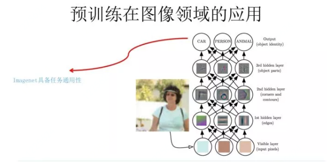
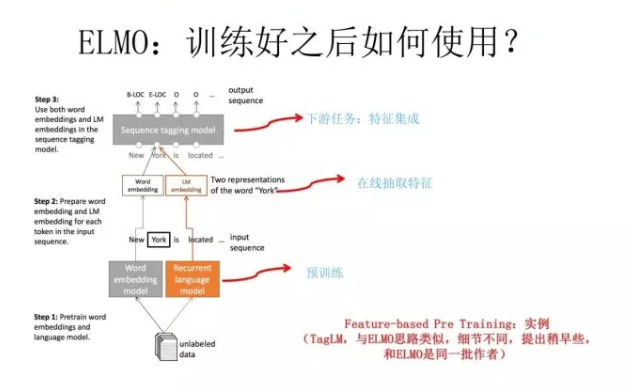
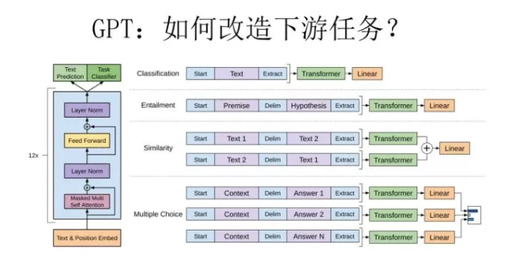

# 
从Word Embedding到Bert模型

张俊林 AI科技大本营  Nov 20 2018

Li Junli 李军利  /  Modified on Apr 21 2019

​	**从Word Embedding到Bert模型——自然语言处理预训练技术发展史**！

​	Bert 最近很火，应该是最近最火爆的 AI 进展，网上的评价很高，为什么会有这么高的评价呢？是因为它有重大的理论或者模型创新吗？其实并没有，从模型创新角度看一般，创新不算大。但是架不住效果太好了，基本刷新了很多 NLP 的任务的最好性能，有些任务还被刷爆了，这个才是关键。另外一点是 Bert 具备广泛的通用性，就是说绝大部分 NLP 任务都可以采用类似的两阶段模式直接去提升效果，这个第二关键。客观的说，把 Bert 当做最近两年 NLP 重大进展的集大成者更符合事实。

​	本文的主题是自然语言处理中的预训练过程，会大致说下 NLP 中的预训练技术是一步一步如何发展到 Bert 模型的，从中可以很自然地看到 Bert 的思路是如何逐渐形成的，Bert 的历史沿革是什么，继承了什么，创新了什么，为什么效果那么好，主要原因是什么，以及为何说模型创新不算太大，为何说 Bert 是近年来 NLP 重大进展的集大成者。

​	一步一步来讲，而串起来这个故事的脉络就是自然语言的预训练过程，但是落脚点还是在 Bert 身上。要讲自然语言的预训练，得先从图像领域的预训练说起。

## **▌**图像领域的预训练

​	自从深度学习火起来后，预训练过程就是做图像或者视频领域的一种比较常规的做法，有比较长的历史了，而且这种做法很有效，能明显促进应用的效果。

​	那么图像领域怎么做预训练呢，上图展示了这个过程，设计好网络结构以后，对于图像来说一般是 CNN 的多层叠加网络结构，可以先用某个训练集合比如训练集合 A 或者训练集合 B 对这个网络进行预先训练，在 A 任务上或者B任务上学会网络参数，然后存起来以备后用。

​	假设现在面临第三个任务 C，网络结构采取相同的网络结构，在比较浅的几层 CNN 结构，网络参数初始化的时候可以加载 A 任务或者 B 任务学习好的参数，其它 CNN 高层参数仍然随机初始化。之后用 C 任务的训练数据来训练网络，此时有两种做法，一种是浅层加载的参数在训练 C 任务过程中不动，这种方法被称为“Frozen”;另外一种是底层网络参数尽管被初始化了，在 C 任务训练过程中仍然随着训练的进程不断改变，这种一般叫“Fine-Tuning”，顾名思义，就是更好地把参数进行调整使得更适应当前的 C 任务。一般图像或者视频领域要做预训练一般都这么做。

​	这么做有几个好处，首先，如果手头任务 C 的训练集合数据量较少的话，现阶段的好用的 CNN 比如 Resnet/Densenet/Inception 等网络结构层数很深，几百万上千万参数量算起步价，上亿参数的也很常见，训练数据少很难很好地训练这么复杂的网络，但是如果其中大量参数通过大的训练集合比如 ImageNet 预先训练好直接拿来初始化大部分网络结构参数，然后再用 C 任务手头比较可怜的数据量上 Fine-tuning 过程去调整参数让它们更适合解决 C 任务，那事情就好办多了。

​	这样原先训练不了的任务就能解决了，即使手头任务训练数据也不少，加个预训练过程也能极大加快任务训练的收敛速度，所以这种预训练方式是老少皆宜的解决方案，另外疗效又好，所以在做图像处理领域很快就流行开来。

​	那么新的问题来了，为什么这种预训练的思路是可行的？

​	目前已经知道，对于层级的 CNN 结构来说，不同层级的神经元学习到了不同类型的图像特征，由底向上特征形成层级结构，如上图所示，如果手头是个人脸识别任务，训练好网络后，把每层神经元学习到的特征可视化肉眼看一看每层学到了啥特征，你会看到最底层的神经元学到的是线段等特征，图示的第二个隐层学到的是人脸五官的轮廓，第三层学到的是人脸的轮廓，通过三步形成了特征的层级结构，越是底层的特征越是所有不论什么领域的图像都会具备的比如边角线弧线等底层基础特征，越往上抽取出的特征越与手头任务相关。

​	正因为此，所以预训练好的网络参数，尤其是底层的网络参数抽取出特征跟具体任务越无关，越具备任务的通用性，所以这是为何一般用底层预训练好的参数初始化新任务网络参数的原因。而高层特征跟任务关联较大，实际可以不用使用，或者采用 Fine-tuning 用新数据集合清洗掉高层无关的特征抽取器。

​	通常用 ImageNet 来做网络的预训练，主要有两点，一方面 ImageNet 是图像领域里有超多事先标注好训练数据的数据集合，分量足是个很大的优势，量越大训练出的参数越靠谱；另外一方面因为 ImageNet 有 1000 类，类别多，算是通用的图像数据，跟领域没太大关系，所以通用性好，预训练完后哪哪都能用，是个万金油。分量足的万金油当然老少通吃，人人喜爱。

​	“既然图像领域预训练这么好用，那干嘛自然语言处理不做这个事情呢？是不是搞 NLP 的人比搞 CV 的傻啊？就算你傻，你看见人家这么做，有样学样不就行了吗？这不就是创新吗，也许能成，万一成了，你看，你的成功来得就是这么突然!”

​	嗯，好问题，其实搞 NLP 的人一点都不傻，早就有人尝试过了，不过总体而言不太成功而已。听说过 word embedding 吗？2003 年出品，陈年技术，馥郁芳香。word embedding 其实就是 NLP 里的早期预训练技术。当然也不能说 word embedding 不成功，一般加到下游任务里，都能有 1 到 2 个点的性能提升，只是没有那么耀眼的成功而已。

​	下面讲讲这段陈年老账。 

## **▌**Word Embedding 考古史

​	这块大致讲讲 Word Embedding 的故事，很粗略，因为网上关于这个技术讲的文章太多了，但是要说预训练又得从这开始，那就粗略地讲讲，主要是引出后面更精彩的部分。在说 Word Embedding 之前，先更粗略地说下语言模型，因为一般 NLP 里面做预训练一般的选择是用语言模型任务来做。

​	什么是语言模型？为了能够量化地衡量哪个句子更像一句人话，可以设计如上图所示函数，核心函数 P 的思想是根据句子里面前面的一系列前导单词预测后面跟哪个单词的概率大小（理论上除了上文之外，也可以引入单词的下文联合起来预测单词出现概率）。句子里面每个单词都有个根据上文预测自己的过程，把所有这些单词的产生概率乘起来，数值越大代表这越像一句人话。

​	假设现在要设计一个神经网络结构，去做这个语言模型的任务，就是说基于很多语料训练好一个神经网络，训练好之后，以后输入一句话的前面几个单词，要求这个网络输出后面紧跟的单词应该是哪个，怎么做呢？

​	可以像上图这么设计这个网络结构，这其实就是大名鼎鼎的中文人称“神经网络语言模型”，英文小名 NNLM 的网络结构，用来做语言模型。是 Bengio 在 2003 年发表在 JMLR 上的论文。它生于 2003，火于 2013。

​	讲一讲 NNLM 的思路，先说训练过程，现在看其实很简单，见过 RNN、LSTM、CNN 后的你们回头再看这个网络甚至显得有些简陋。学习任务是输入某个句中 Wt  = "Bert"单词前面句子的 t-1 个单词，要求网络正确预测单词 "Bert"，即最大化：
$$
P(W_t = Bert|W_1,W_2,...,W_{t-1};\theta)
$$

​	前面任意单词 Wi 用Onehot编码（比如：0001000）作为原始单词输入，之后乘以矩阵 Q 后获得向量C(Wi)，每个单词的 C(Wi) 拼接，上接隐层，然后接 softmax 去预测后面应该后续接哪个单词。这个 C(Wi) 是什么？这其实就是单词对应的 Word Embedding 值，那个矩阵 Q 包含 V 行，V 代表词典大小，每一行内容代表对应单词的 Word embedding 值。只不过 Q 的内容也是网络参数，需要学习获得，训练刚开始用随机值初始化矩阵 Q，当这个网络训练好之后，矩阵 Q 的内容被正确赋值，每一行代表一个单词对应的 Word embedding 值。

​	通过这个网络学习语言模型任务，这个网络不仅自己能够根据上文预测后接单词是什么，同时获得一个副产品，就是那个矩阵 Q，这就是单词的 Word Embedding 是被如何学会的。

​	2013 年最火的用语言模型做 Word Embedding 的工具是 Word2Vec，后来又出了 Glove，Word2Vec 是怎么工作的呢？看下图。

​	Word2Vec 的网络结构其实和 NNLM 是基本类似的，只是这个图长得清晰度差了点，看上去不像，其实它们是亲兄弟。不过这里需要指出：尽管网络结构相近，而且也是做语言模型任务，但是其训练方法不太一样。Word2Vec 有两种训练方法，一种叫 CBOW，核心思想是从一个句子里面把一个词抠掉，用这个词的上文和下文去预测被抠掉的这个词；第二种叫做 Skip-gram，和 CBOW 正好反过来，输入某个单词，要求网络预测它的上下文单词。

​	而回头看看，NNLM 是怎么训练的？是输入一个单词的上文，去预测这个单词。这是有显著差异的。为什么 Word2Vec 这么处理？原因很简单，因为 Word2Vec 和 NNLM 不一样，NNLM 的主要任务是要学习一个解决语言模型任务的网络结构，语言模型就是要看到上文预测下文，而 word embedding 只是无心插柳的一个副产品。但是 Word2Vec 目标不一样，它单纯就是要 word embedding 的，这是主产品，所以它完全可以随性地这么去训练网络。

​	为什么要讲 Word2Vec 呢？这里主要是要引出 CBOW 的训练方法，BERT 其实跟它有关系，后面会讲它们之间是如何的关系。

​	

​	使用 Word2Vec 或者 Glove，通过做语言模型任务，就可以获得每个单词的 Word Embedding，那么这种方法的效果如何呢？上图给了网上找的几个例子，可以看出有些例子效果还是很不错的，一个单词表达成 Word Embedding 后，很容易找出语义相近的其它词汇。

​	我们的主题是预训练，那么问题是 Word Embedding 这种做法能算是预训练吗？这其实就是标准的预训练过程。要理解这一点要看看学会 Word Embedding 后下游任务是怎么用它的。

​	假设如上图所示，我们有个 NLP 的下游任务，比如 QA，就是问答问题，所谓问答问题，指的是给定一个问题 X，给定另外一个句子 Y, 要判断句子 Y 是否是问题 X 的正确答案。问答问题假设设计的网络结构如上图所示，这里不展开讲了，懂得自然懂，不懂的也没关系，因为这点对于本文主旨来说不关键，关键是网络如何使用训练好的 Word Embedding 的。

​	它的使用方法其实和前面讲的 NNLM 是一样的，句子中每个单词以 Onehot 形式作为输入，然后乘以学好的 Word Embedding 矩阵 Q，就直接取出单词对应的 Word Embedding 了。这乍看上去好像是个查表操作，不像是预训练的做法是吧？其实不然，那个 Word Embedding 矩阵 Q 其实就是网络 Onehot 层到 embedding 层映射的网络参数矩阵。

​	所以使用 Word Embedding 等价于什么？等价于把 Onehot 层到 embedding 层的网络用预训练好的参数矩阵 Q 初始化了。这跟前面讲的图像领域的低层预训练过程其实是一样的，区别无非 Word Embedding 只能初始化第一层网络参数，再高层的参数就无能为力了。下游 NLP 任务在使用 Word Embedding 的时候也类似图像有两种做法：

- 一种是 Frozen，就是 Word Embedding 那层网络参数固定不动；
- 另外一种是 Fine-Tuning，就是 Word Embedding 这层参数使用新的训练集合训练也需要跟着训练过程更新掉。

​	上面这种做法就是 18 年之前 NLP 领域里面采用预训练的典型做法，之前说过，Word Embedding 其实对于很多下游 NLP 任务是有帮助的，只是帮助没有大到闪瞎忘记戴墨镜的围观群众的双眼而已。那么新问题来了，为什么这样训练及使用 Word Embedding 的效果没有期待中那么好呢？答案很简单，因为 Word Embedding 有问题呗。这貌似是个比较弱智的答案，关键是 Word Embedding 存在什么问题？这其实是个好问题。

​	这片在 Word Embedding 头上笼罩了好几年的乌云是什么？是多义词问题。我们知道，多义词是自然语言中经常出现的现象，也是语言灵活性和高效性的一种体现。多义词对 Word Embedding 来说有什么负面影响？

​	如上图所示，比如多义词 Bank，有两个常用含义，但是 Word Embedding 在对 bank 这个单词进行编码的时候，是区分不开这两个含义的，因为它们尽管上下文环境中出现的单词不同，但是在用语言模型训练的时候，不论什么上下文的句子经过 word2vec，都是预测相同的单词 bank，而同一个单词占的是同一行的参数空间，这导致两种不同的上下文信息都会编码到相同的 word embedding 空间里去。所以 word embedding 无法区分多义词的不同语义，这就是它的一个比较严重的问题。

​	你可能觉得自己很聪明，说这可以解决啊，确实也有很多研究人员提出很多方法试图解决这个问题，但是从今天往回看，这些方法看上去都成本太高或者太繁琐了，有没有简单优美的解决方案呢？

​	ELMO 提供了一种简洁优雅的解决方案。

## **▌**从 Word Embedding 到 ELMO

​	ELMO 是“Embedding from Language Models”的简称，其实这个名字并没有反应它的本质思想，提出ELMO的论文题目：“Deep contextualized word representation”更能体现其精髓，而精髓在哪里？在 deep contextualized 这个短语，一个是 deep，一个是 context，其中 context 更关键。在此之前的 Word Embedding 本质上是个静态的方式，所谓静态指的是训练好之后每个单词的表达就固定住了，以后使用的时候，不论新句子上下文单词是什么，这个单词的 Word Embedding 不会跟着上下文场景的变化而改变，所以对于比如 Bank 这个词，它事先学好的 Word Embedding 中混合了几种语义，在应用中来了个新句子，即使从上下文中（比如句子包含 money 等词）明显可以看出它代表的是「银行」的含义，但是对应的 Word Embedding 内容也不会变，它还是混合了多种语义。这是为何说它是静态的，这也是问题所在。

​	ELMO 的本质思想是：我事先用语言模型学好一个单词的 Word Embedding，此时多义词无法区分，不过这没关系。在我实际使用 Word Embedding 的时候，单词已经具备了特定的上下文了，这个时候我可以根据上下文单词的语义去调整单词的 Word Embedding 表示，这样经过调整后的 Word Embedding 更能表达在这个上下文中的具体含义，自然也就解决了多义词的问题了。所以 ELMO 本身是个根据当前上下文对 Word Embedding 动态调整的思路。

​	ELMO 采用了典型的两阶段过程，第一个阶段是利用语言模型进行预训练；第二个阶段是在做下游任务时，从预训练网络中提取对应单词的网络各层的 Word Embedding 作为新特征补充到下游任务中。

​	上图展示的是其预训练过程，它的网络结构采用了双层双向 LSTM，目前语言模型训练的任务目标是根据单词Wi 的上下文去正确预测单词Wi，之前的单词序列 Context-before 称为上文，之后的单词序列 Context-after 称为下文。图中左端的前向双层LSTM代表正方向编码器，输入的是从左到右顺序的除了预测单词外的上文 Context-before；右端的逆向双层 LSTM 代表反方向编码器，输入的是从右到左的逆序的句子下文 Context-after；每个编码器的深度都是两层 LSTM 叠加。这个网络结构其实在 NLP 中是很常用的。

​	使用这个网络结构利用大量语料做语言模型任务就能预先训练好这个网络，如果训练好这个网络后，输入一个新句子 *Snew*，句子中每个单词都能得到对应的三个Embedding:

​	最底层是单词的 Word Embedding；往上走是第一层双向 LSTM中对应单词位置的 Embedding，这层编码单词的句法信息更多一些；再往上走是第二层 LSTM 中对应单词位置的 Embedding，这层编码单词的语义信息更多一些。也就是说，ELMO 的预训练过程不仅仅学会单词的 Word Embedding，还学会了一个双层双向的 LSTM 网络结构，而这两者后面都有用。 

​	上面介绍的是 ELMO 的第一阶段：预训练阶段。那么预训练好网络结构后，如何给下游任务使用呢？上图展示了下游任务的使用过程，比如我们的下游任务仍然是 QA 问题，此时对于问句 X，我们可以先将句子 X 作为预训练好的 ELMO 网络的输入，这样句子 X 中每个单词在 ELMO 网络中都能获得对应的三个 Embedding，之后给予这三个 Embedding 中的每一个 Embedding 一个权重 a，这个权重可以学习得来，根据各自权重累加求和，将三个 Embedding 整合成一个。

​	然后将整合后的这个 Embedding 作为 X 句在自己任务的那个网络结构中对应单词的输入，以此作为补充的新特征给下游任务使用。对于上图所示下游任务 QA 中的回答句子 Y 来说也是如此处理。

​	因为 ELMO给下游提供的是每个单词的特征形式，所以这一类预训练的方法被称为“Feature-based Pre-Training”。至于为何这么做能够达到区分多义词的效果，你可以想一想，其实比较容易想明白原因。

​	上面这个图是 TagLM 采用类似 ELMO 的思路做命名实体识别任务的过程，其步骤基本如上述 ELMO 的思路，所以此处不展开说了。TagLM 的论文发表在 2017 年的 ACL 会议上，作者就是 AllenAI 里做 ELMO 的那些人，所以可以将 TagLM 看做 ELMO 的一个前导工作。前几天这个 PPT 发出去后有人质疑说 FastAI 的在 18 年 4 月提出的 ULMFiT 才是抛弃传统 Word Embedding 引入新模式的开山之作，我深不以为然。

​	首先 TagLM 出现的更早而且模式基本就是 ELMO 的思路；另外 ULMFiT 使用的是三阶段模式，在通用语言模型训练之后，加入了一个领域语言模型预训练过程，而且论文重点工作在这块，方法还相对比较繁杂，这并不是一个特别好的主意，因为领域语言模型的限制是它的规模往往不可能特别大，精力放在这里不太合适，放在通用语言模型上感觉更合理；再者，尽管 ULFMiT 实验做了 6 个任务，但是都集中在分类问题相对比较窄，不如 ELMO 验证的问题领域广，我觉得这就是因为第二步那个领域语言模型带来的限制。所以综合看，尽管 ULFMiT 也是个不错的工作，但是重要性跟 ELMO 比至少还是要差一档，当然这是我个人看法。

​	每个人的学术审美口味不同，我个人一直比较赞赏要么简洁有效体现问题本质要么思想特别游离现有框架脑洞开得异常大的工作，所以 ULFMiT 我看论文的时候就感觉看着有点难受，觉得这工作没抓住重点而且特别麻烦，但是看 ELMO 论文感觉就赏心悦目，觉得思路特别清晰顺畅，看完暗暗点赞，心里说这样的文章获得 NAACL2018 最佳论文当之无愧，比 ACL 很多最佳论文也好得不是一点半点，这就是好工作带给一个有经验人士的一种在读论文时候就能产生的本能的感觉，也就是所谓的这道菜对上了食客的审美口味。

​	

​	前面我们提到静态 Word Embedding 无法解决多义词的问题，那么 ELMO 引入上下文动态调整单词的 embedding 后多义词问题解决了吗？解决了，而且比我们期待的解决得还要好。

​	上图给了个例子，对于 Glove 训练出的 Word Embedding 来说，多义词比如 play，根据它的 embedding 找出的最接近的其它单词大多数集中在体育领域，这很明显是因为训练数据中包含 play 的句子中体育领域的数量明显占优导致；而使用 ELMO，根据上下文动态调整后的 embedding 不仅能够找出对应的「演出」的相同语义的句子，而且还可以保证找出的句子中的 play 对应的词性也是相同的，这是超出期待之处。之所以会这样，是因为我们上面提到过，第一层 LSTM 编码了很多句法信息，这在这里起到了重要作用。

​	ELMO 经过这般操作，效果如何呢？实验效果见上图，6 个 NLP 任务中性能都有幅度不同的提升，最高的提升达到 25% 左右，而且这 6 个任务的覆盖范围比较广，包含句子语义关系判断，分类任务，阅读理解等多个领域，这说明其适用范围是非常广的，普适性强，这是一个非常好的优点。

​	那么站在现在这个时间节点看，ELMO 有什么值得改进的缺点呢？首先，一个非常明显的缺点在特征抽取器选择方面，ELMO 使用了 LSTM 而不是新贵 Transformer，Transformer 是谷歌在 17 年做机器翻译任务的“Attention is all you need”的论文中提出的，引起了相当大的反响，很多研究已经证明了 Transformer 提取特征的能力是要远强于 LSTM 的。如果 ELMO 采取 Transformer 作为特征提取器，那么估计 Bert 的反响远不如现在的这种火爆场面。另外一点，ELMO 采取双向拼接这种融合特征的能力可能比 Bert 一体化的融合特征方式弱，但是，这只是一种从道理推断产生的怀疑，目前并没有具体实验说明这一点。

​	我们如果把 ELMO 这种预训练方法和图像领域的预训练方法对比，发现两者模式看上去还是有很大差异的。除了以 ELMO 为代表的这种基于特征融合的预训练方法外，NLP 里还有一种典型做法，这种做法和图像领域的方式就是看上去一致的了，一般将这种方法称为“基于 Fine-tuning 的模式”，而 GPT 就是这一模式的典型开创者。

## **▌**从 Word Embedding 到 GPT

​	GPT 是“Generative Pre-Training”的简称，从名字看其含义是指的生成式的预训练。GPT 也采用两阶段过程，第一个阶段是利用语言模型进行预训练，第二阶段通过 Fine-tuning 的模式解决下游任务。上图展示了 GPT 的预训练过程，其实和 ELMO 是类似的，主要不同在于两点：

​	首先，特征抽取器不是用的 RNN，而是用的 Transformer，上面提到过它的特征抽取能力要强于 RNN，这个选择很明显是很明智的；

​	其次，GPT 的预训练虽然仍然是以语言模型作为目标任务，但是采用的是单向的语言模型，所谓“单向”的含义是指：语言模型训练的任务目标是根据单词的上下文去正确预测单词，之前的单词序列 Context-before 称为上文，之后的单词序列 Context-after 称为下文。ELMO 在做语言模型预训练的时候，预测单词同时使用了上文和下文，而 GPT 则只采用 Context-before 这个单词的上文来进行预测，而抛开了下文。

​	这个选择现在看不是个太好的选择，原因很简单，它没有把单词的下文融合进来，这限制了其在更多应用场景的效果，比如阅读理解这种任务，在做任务的时候是可以允许同时看到上文和下文一起做决策的。如果预训练时候不把单词的下文嵌入到 Word Embedding 中，是很吃亏的，白白丢掉了很多信息。

​	这里强行插入一段简单提下 Transformer，尽管上面提到了，但是说的还不完整，补充两句。首先，Transformer 是个叠加的“自注意力机制（Self Attention）”构成的深度网络，是目前 NLP 里最强的特征提取器，注意力这个机制在此被发扬光大，从任务的配角不断抢戏，直到 Transformer 一跃成为踢开 RNN 和 CNN 传统特征提取器，荣升头牌，大红大紫。你问了：什么是注意力机制？对注意力不了解的可以参考 [深度学习中的注意力模型](<https://blog.csdn.net/malefactor/article/details/78767781>)，补充下相关基础知识，如果不了解注意力机制你肯定会落后时代的发展。而介绍 Transformer 比较好的文章可以参考哈佛大学 NLP 研究组写的“The Annotated Transformer. ”，代码原理双管齐下，讲得非常清楚，这里不展开介绍。

​	其次，我的判断是 Transformer 在未来会逐渐替代掉 RNN 成为主流的 NLP 工具，RNN 一直受困于其并行计算能力，这是因为它本身结构的序列性依赖导致的，尽管很多人在试图通过修正 RNN 结构来修正这一点，但是我不看好这种模式，因为给马车换轮胎不如把它升级到汽车，这个道理很好懂，更何况目前汽车的雏形已经出现了，干嘛还要执着在换轮胎这个事情呢？是吧？再说 CNN，CNN 在 NLP 里一直没有形成主流，CNN 的最大优点是易于做并行计算，所以速度快，但是在捕获 NLP 的序列关系尤其是长距离特征方面天然有缺陷，不是做不到而是做不好，目前也有很多改进模型，但是特别成功的不多。综合各方面情况，很明显 Transformer 同时具备并行性好，又适合捕获长距离特征，没有理由不在赛跑比赛中跑不过 RNN 和 CNN。

​	好了，题外话结束，我们再回到主题，接着说 GPT。上面讲的是 GPT 如何进行第一阶段的预训练，那么假设预训练好了网络模型，后面下游任务怎么用？它有自己的个性，和 ELMO 的方式大有不同。

​	上图展示了 GPT 在第二阶段如何使用。首先，对于不同的下游任务来说，本来你可以任意设计自己的网络结构，现在不行了，你要向 GPT 的网络结构看齐，把任务的网络结构改造成和 GPT 的网络结构是一样的。然后，在做下游任务的时候，利用第一步预训练好的参数初始化 GPT 的网络结构，这样通过预训练学到的语言学知识就被引入到你手头的任务里来了，这是个非常好的事情。再次，你可以用手头的任务去训练这个网络，对网络参数进行 Fine-tuning，使得这个网络更适合解决手头的问题。就是这样。看到了么？这有没有让你想起最开始提到的图像领域如何做预训练的过程（请参考上图那句非常容易暴露年龄的歌词）？对，这跟那个模式是一模一样的。

​	这里引入了一个新问题：对于 NLP 各种花样的不同任务，怎么改造才能靠近 GPT 的网络结构呢？

​	GPT 论文给了一个改造施工图如上，其实也很简单：对于分类问题，不用怎么动，加上一个起始和终结符号即可；对于句子关系判断问题，比如 Entailment，两个句子中间再加个分隔符即可；对文本相似性判断问题，把两个句子顺序颠倒下做出两个输入即可，这是为了告诉模型句子顺序不重要；对于多项选择问题，则多路输入，每一路把文章和答案选项拼接作为输入即可。从上图可看出，这种改造还是很方便的，不同任务只需要在输入部分施工即可。

​	

​	GPT 的效果是非常令人惊艳的，在 12 个任务里，9 个达到了最好的效果，有些任务性能提升非常明显。

​	那么站在现在的时间节点看，GPT 有什么值得改进的地方呢？其实最主要的就是那个单向语言模型，如果改造成双向的语言模型任务估计也没有 Bert 太多事了。当然，即使如此 GPT 也是非常非常好的一个工作，跟 Bert 比，其作者炒作能力亟待提升。

## **▌**Bert 的诞生

​	我们经过跋山涉水，终于到了目的地 Bert 模型了。

​	Bert 采用和 GPT 完全相同的两阶段模型，首先是语言模型预训练；其次是使用 Fine-Tuning 模式解决下游任务。和 GPT 的最主要不同在于在预训练阶段采用了类似 ELMO 的双向语言模型，当然另外一点是语言模型的数据规模要比 GPT 大。所以这里 Bert 的预训练过程不必多讲了。

​	第二阶段，Fine-Tuning 阶段，这个阶段的做法和 GPT 是一样的。当然，它也面临着下游任务网络结构改造的问题，在改造任务方面 Bert 和 GPT 有些不同，下面简单介绍一下。

​	在介绍 Bert 如何改造下游任务之前，先大致说下 NLP 的几类问题，说这个是为了强调 Bert 的普适性有多强。通常而言，绝大部分 NLP 问题可以归入上图所示的四类任务中：

- 一类是序列标注，这是最典型的 NLP 任务，比如中文分词，词性标注，命名实体识别，语义角色标注等都可以归入这一类问题，它的特点是句子中每个单词要求模型根据上下文都要给出一个分类类别。
- 第二类是分类任务，比如我们常见的文本分类，情感计算等都可以归入这一类。它的特点是不管文章有多长，总体给出一个分类类别即可。
- 第三类任务是句子关系判断，比如 Entailment，QA，语义改写，自然语言推理等任务都是这个模式，它的特点是给定两个句子，模型判断出两个句子是否具备某种语义关系。
- 第四类是生成式任务，比如机器翻译，文本摘要，写诗造句，看图说话等都属于这一类。它的特点是输入文本内容后，需要自主生成另外一段文字。

​	对于种类如此繁多而且各具特点的下游 NLP 任务，Bert 如何改造输入输出部分使得大部分 NLP 任务都可以使用 Bert 预训练好的模型参数呢？

​	上图给出示例，对于句子关系类任务，很简单，和 GPT 类似，加上一个起始和终结符号，句子之间加个分隔符即可。对于输出来说，把第一个起始符号对应的 Transformer 最后一层位置上面串接一个 softmax 分类层即可。对于分类问题，与 GPT 一样，只需要增加起始和终结符号，输出部分和句子关系判断任务类似改造；对于序列标注问题，输入部分和单句分类是一样的，只需要输出部分 Transformer 最后一层每个单词对应位置都进行分类即可。从这里可以看出，上面列出的 NLP 四大任务里面，除了生成类任务外，Bert 其它都覆盖到了，而且改造起来很简单直观。

​	尽管 Bert 论文没有提，但是稍微动动脑子就可以想到，其实对于机器翻译或者文本摘要，聊天机器人这种生成式任务，同样可以稍作改造即可引入 Bert 的预训练成果。只需要附着在 S2S 结构上，encoder 部分是个深度 Transformer 结构，decoder 部分也是个深度 Transformer 结构。根据任务选择不同的预训练数据初始化 encoder 和 decoder 即可。这是相当直观的一种改造方法。当然，也可以更简单一点，比如直接在单个 Transformer 结构上加装隐层产生输出也是可以的。

​	不论如何，从这里可以看出，NLP 四大类任务都可以比较方便地改造成 Bert 能够接受的方式。这其实是 Bert 的非常大的优点，这意味着它几乎可以做任何 NLP 的下游任务，具备普适性，这是很强的。

​	Bert 采用这种两阶段方式解决各种 NLP 任务效果如何？在 11 个各种类型的 NLP 任务中达到目前最好的效果，某些任务性能有极大的提升。一个新模型好不好，效果才是王道。

​	到这里我们可以再梳理下几个模型之间的演进关系。从上图可见，Bert 其实和 ELMO 及 GPT 存在千丝万缕的关系，比如如果我们把 GPT 预训练阶段换成双向语言模型，那么就得到了 Bert；而如果我们把 ELMO 的特征抽取器换成 Transformer，那么我们也会得到 Bert。所以你可以看出：Bert 最关键两点，一点是特征抽取器采用 Transformer；第二点是预训练的时候采用双向语言模型。

​	那么新问题来了：对于 Transformer 来说，怎么才能在这个结构上做双向语言模型任务呢？

​	乍一看上去好像不太好搞。我觉得吧，其实有一种很直观的思路，怎么办？看看 ELMO 的网络结构图，只需要把两个 LSTM 替换成两个 Transformer，一个负责正向，一个负责反向特征提取，其实应该就可以。当然这是我自己的改造，Bert 没这么做。那么 Bert 是怎么做的呢？我们前面不是提过 Word2Vec 吗？我前面肯定不是漫无目的地提到它，提它是为了在这里引出那个 CBOW 训练方法，所谓写作时候埋伏笔的「草蛇灰线，伏脉千里」，大概就是这个意思吧？

​	前面提到了 CBOW 方法，它的核心思想是：在做语言模型任务的时候，我把要预测的单词抠掉，然后根据它的上文 Context-Before 和下文 Context-after 去预测单词。其实 Bert 怎么做的？Bert 就是这么做的。从这里可以看到方法间的继承关系。当然 Bert 作者没提 Word2Vec 及 CBOW 方法，这是我的判断，Bert 作者说是受到完形填空任务的启发，这也很可能，但是我觉得他们要是没想到过 CBOW 估计是不太可能的。

​	从这里可以看出，在文章开始我说过 Bert 在模型方面其实没有太大创新，更像一个最近几年 NLP 重要技术的集大成者，原因在于此，当然我不确定你怎么看，是否认同这种看法，而且我也不关心你怎么看。其实 Bert 本身的效果好和普适性强才是最大的亮点。

​	那么 Bert 本身在模型和方法角度有什么创新呢？就是论文中指出的 Masked 语言模型和 Next Sentence Prediction。而 Masked 语言模型上面讲了，本质思想其实是 CBOW，但是细节方面有改进。

	

​	Masked 双向语言模型向上图展示这么做：随机选择语料中 15% 的单词，把它抠掉，也就是用 [Mask] 掩码代替原始单词，然后要求模型去正确预测被抠掉的单词。但是这里有个问题：训练过程大量看到 [mask] 标记，但是真正后面用的时候是不会有这个标记的，这会引导模型认为输出是针对 [mask] 这个标记的，但是实际使用又见不到这个标记，这自然会有问题。

为了避免这个问题，Bert 改造了一下，15% 的被上天选中要执行 [mask] 替身这项光荣任务的单词中，只有 80% 真正被替换成 [mask] 标记，10% 被狸猫换太子随机替换成另外一个单词，10% 情况这个单词还待在原地不做改动。这就是 Masked 双向语音模型的具体做法。

​	至于说“Next Sentence Prediction”，指的是做语言模型预训练的时候，分两种情况选择两个句子，一种是选择语料中真正顺序相连的两个句子；另外一种是第二个句子从语料库中抛色子，随机选择一个拼到第一个句子后面。我们要求模型除了做上述的 Masked 语言模型任务外，附带再做个句子关系预测，判断第二个句子是不是真的是第一个句子的后续句子。

之所以这么做，是考虑到很多 NLP 任务是句子关系判断任务，单词预测粒度的训练到不了句子关系这个层级，增加这个任务有助于下游句子关系判断任务。所以可以看到，它的预训练是个多任务过程。这也是 Bert 的一个创新。

​	上面这个图给出了一个我们此前利用微博数据和开源的 Bert 做预训练时随机抽出的一个中文训练实例，从中可以体会下上面讲的 masked 语言模型和下句预测任务。训练数据就长这种样子。

​	顺带讲解下 Bert 的输入部分，也算是有些特色。它的输入部分是个线性序列，两个句子通过分隔符分割，最前面和最后增加两个标识符号。每个单词有三个 embedding：

- 位置信息 embedding，这是因为 NLP 中单词顺序是很重要的特征，需要在这里对位置信息进行编码；
- 单词 embedding, 这个就是我们之前一直提到的单词 embedding；
- 句子 embedding，因为前面提到训练数据都是由两个句子构成的，那么每个句子有个句子整体的 embedding 项对应给每个单词。把单词对应的三个 embedding 叠加，就形成了 Bert 的输入。

​	至于 Bert 在预训练的输出部分如何组织，可以参考上图的注释。

​	我们说过 Bert 效果特别好，那么到底是什么因素起作用呢？如上图所示，对比试验可以证明，跟 GPT 相比，双向语言模型起到了最主要的作用，对于那些需要看到下文的任务来说尤其如此。而预测下个句子来说对整体性能来说影响不算太大，跟具体任务关联度比较高。

​	最后，我讲讲我对 Bert 的评价和看法，我觉得 Bert 是 NLP 里里程碑式的工作，对于后面 NLP 的研究和工业应用会产生长久的影响，这点毫无疑问。但是从上文介绍也可以看出，从模型或者方法角度看，Bert 借鉴了 ELMO，GPT 及 CBOW，主要提出了 Masked 语言模型及 Next Sentence Prediction，但是这里 Next Sentence Prediction 基本不影响大局，而 Masked LM 明显借鉴了 CBOW 的思想。所以说 Bert 的模型没什么大的创新，更像最近几年 NLP 重要进展的集大成者，这点如果你看懂了上文估计也没有太大异议，如果你有大的异议，杠精这个大帽子我随时准备戴给你。如果归纳一下这些进展就是：

- 首先是两阶段模型，第一阶段双向语言模型预训练，这里注意要用双向而不是单向，第二阶段采用具体任务 Fine-tuning 或者做特征集成；
- 第二是特征抽取要用 Transformer 作为特征提取器而不是 RNN 或者 CNN；
- 第三，双向语言模型可以采取 CBOW 的方法去做（当然我觉得这个是个细节问题，不算太关键，前两个因素比较关键）。

​	Bert 最大的亮点在于效果好及普适性强，几乎所有 NLP 任务都可以套用 Bert 这种两阶段解决思路，而且效果应该会有明显提升。可以预见的是，未来一段时间在 NLP 应用领域，Transformer 将占据主导地位，而且这种两阶段预训练方法也会主导各种应用。

​	另外，我们应该弄清楚预训练这个过程本质上是在做什么事情，本质上预训练是通过设计好一个网络结构来做语言模型任务，然后把大量甚至是无穷尽的无标注的自然语言文本利用起来，预训练任务把大量语言学知识抽取出来编码到网络结构中，当手头任务带有标注信息的数据有限时，这些先验的语言学特征当然会对手头任务有极大的特征补充作用，因为当数据有限的时候，很多语言学现象是覆盖不到的，泛化能力就弱，集成尽量通用的语言学知识自然会加强模型的泛化能力。

​	如何引入先验的语言学知识其实一直是 NLP 尤其是深度学习场景下的 NLP 的主要目标之一，不过一直没有太好的解决办法，而 ELMO/GPT/Bert 的这种两阶段模式看起来无疑是解决这个问题自然又简洁的方法，这也是这些方法的主要价值所在。

​	对于当前 NLP 的发展方向，我个人觉得有两点非常重要，一个是需要更强的特征抽取器，目前看 Transformer 会逐渐担当大任，但是肯定还是不够强的，需要发展更强的特征抽取器；第二个就是如何优雅地引入大量无监督数据中包含的语言学知识，注意我这里强调地是优雅，而不是引入，此前相当多的工作试图做各种语言学知识的嫁接或者引入，但是很多方法看着让人牙疼，就是我说的不优雅。目前看预训练这种两阶段方法还是很有效的，也非常简洁，当然后面肯定还会有更好的模型出现。

以上就是自然语言模型预训练的发展史。

## 声明

​	除了部分改动外，其他大都搬运张俊林写的"从Word Embedding 到 Bert"一文

​	张俊林简介：中国中文信息学会理事，目前在新浪微博 AI Lab 担任资深算法专家。在此之前，张俊林曾经在阿里巴巴任资深技术专家，以及在百度和用友担任技术经理及技术总监等职务。同时他是技术书籍《这就是搜索引擎：核心技术详解》（该书荣获全国第十二届输出版优秀图书奖）、《大数据日知录：架构与算法》的作者。

​	本文供学习使用，转载请标明出处，欢迎访问[个人github](https://github.com/Ljl-Jdsk)。