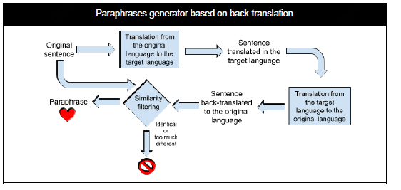
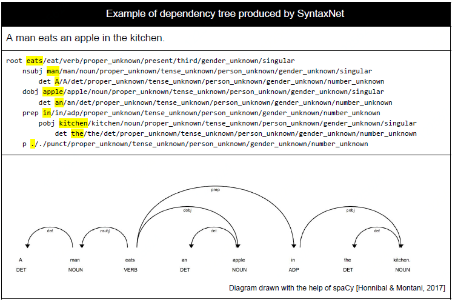
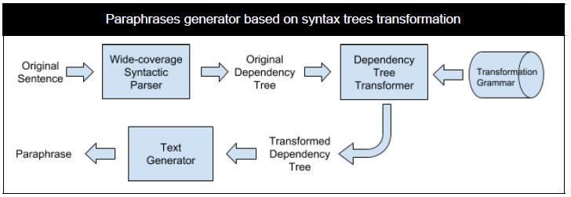
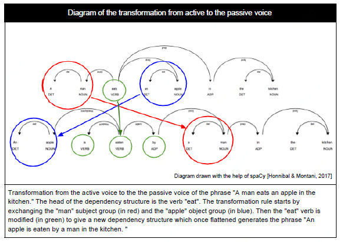
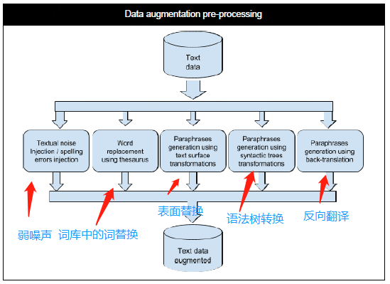
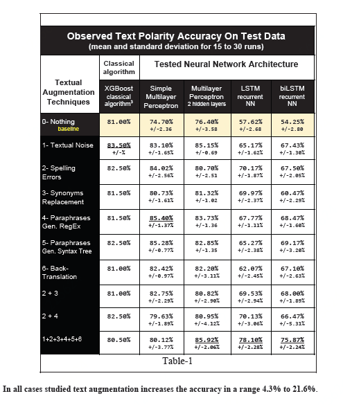

# 特定领域的短文本数据增强

Li Junli 李军利  /  Apr 28 2019

NLP中的数据是离散的。它的后果是我们无法对输入数据进行直接简单地转换，而大多数CV工具则没有这个限制，如domain randomization。

文本中，小的扰动可能会改变含义。在NLP中，删掉一个否定词可能会改变整个句子的情绪，而修改一段话中的某个词甚至会改变语意。但CV不存在这种情况，不论图像中的是猫还是狗，扰动单个像素一般不会影响模型预测，甚至都不会出现明显变化，如插值就是一种有效的图像处理技术[12]。

直到最近，唯一广泛的文本增强技术是词汇替换，包括用同义词替换一个单词的同义词。每个人都在这样做，但没有人谈论它。也就是说，使用手工制作的规则是一个公开的秘密，其中包括噪音注入和普通表达式通常会被实践者用来增加文本数据，在几乎所有聊天机器人引擎中都可以找到手工制作的规则[1]。

特定领域文本数据增强的主要有几类方法：

1. 随机drop（删除）或者、shuffle（打乱词序）、更改、添加等注入弱噪声技术
2. 同义词替换、文本表面替换等替换类方法
3. 反向翻译
4. 根据语法树和语法结构生成句子
5. 将原始句子作为搜索内容，维基百科等返回的答案标题 与原始句子具有相似性
6. HMM、Seq2Seq、Bert、Transformer、GAN 等技术 生成句子

2，3，4比较适合，其中4可能最适合，几种办法的组合也可以尝试。

## 1. 弱噪声

​	最接近文本连续变化的是注入弱文本声音：更改，添加，删除字母，更改案例，修改标点符号。将噪声注入神经网络可以被视为数据增强的一种形式。 它通过向其输入添加随机噪声，可以提高神经网络的鲁棒性。 

​	弱噪声技术是增强算法稳定性层面的，本质是一种正则化技术，暂时不适合用于增加样本量。

## 2. 替换

同义词替换[5, 10]：

同义词替换有两个方面的问题——哪些词应该被替换，和同义词库应该是哪个同义词用于替换[6]。

如果数据稀缺且原始数据分布具有变换不变性属性，使用转换生成其他数据可以提高性能[7, 8]。

同义词替换的 优点是 可以生成大量相似的文本数据，缺点则是太相似了。同义词替换可以通过一些优化算法替换多个词，和控制不能替换的词，使得两句话结构稍有不同。在许多情况下，我们限制只替换副词和形容词，有时会添加名词，很少替换动词。对于词汇替换，经常倾向于使用超名词（更通用的词，郁金香=>花）避免使用下位词（更准确的词，花=>郁金香）。

用真正的同义词替换单词和用超字符替换单词（更一般的单词）都是一个语义不变的转换。

Navigli 等人[4]  通过使用WordNet语义网络用于识别同一意义上的其他单词而不仅仅是使用同义词。与只使用同义词相比，他们的方法平均表现好2％，目前还不清楚这一结果是否具有统计意义，研究人员承认，他们更愿意在更大的语料库上重复他们的实验短文。

文本表面变换的举例[5]：

文本表面替换不太适合汉语。

## 3. 反向翻译

在线翻译工具（中文->[英、法、德、俄、西班牙、葡萄牙、日、韩、荷兰、阿拉伯]等语言）[5, 12]然后再由这些语言反向翻译回中文。

跟同义词替换类方法类似，反向翻译能生成较多相似句子；句子结构的差异性比同义词替换好，反向翻译的句子也可能不通顺，实现成本比同义词替换高。

## 4. 根据语法生成

查找主谓宾词，生成句法结构。

语法树示意图[5]：

在依赖树中，可以找到动词与名词之间的依赖关系、主题短语的头部，或名词和修饰它的形容词之间的依赖关系。

从被动动词形式到主动动词形式的过渡，反之亦然；用代名词代替名词或名义群体；形容词，副词，形容词组的撤回或者一个状语组都是一个语义不变的变换。

主动变被动语义不变的句子转化例子：

"一个男人在厨房吃了一个苹果"变换成"苹果被一个男人在厨房吃掉"

语法树实现的变换，句子结构不同。

## 5. 搜索生成

主要步骤是将原始短文本，作为搜索内容在维基百科进行搜索，维基百科返回的标题是与原始短文相似的文本，衡量文本表达意思是否相同的指标 F值可以达到0.78。Banerjee and colleagues[2]用了一个来自维基百科的外部数据与遗留相关反馈方法的混合短文。 通过将短文作为查询发给维基百科，研究人员进行了补充使用返回文章中的标题的短文本。 混合方法完成了与原始基线方法相比，聚类精度提高约8％。相似的方法，[3]中使用了完整的维基百科文章及其中包含的实体，而不仅仅是增加短文的标题。

(英文)短文本数据增强最常用到的外部数据源是维基百科和WordNet[1]。

搜索生成的准确率和样本量都可以，可能必须得通过爬虫来实现。

## 6. 语言模型

语言模型通过前面的单词预测句子中会出现的下一个单词或者基于句子直接生成相似句子。

实现成本高，质量比较一般。

## 几种方法的效果

5种方法:

文本增强前后分类准确率：

文本增强后，XGBoost的分类准确率变化不大，神经网络模型的准确率都有提升。6种方法的组合准确率最高。

 

## 参考文献

[1] A Data Augmentation Approach to Short Text Classication.UNIVERSITY OF CALIFORNIA Los Angeles

[2] Somnath Banerjee, Krishnan Ramanathan, and Ajay Gupta. Clustering short texts using wikipedia. In 

​      Proceedings of the 30th annual international ACM SIGIR con-ference on Research and development in 

​      information retrieval, pages 787-788. ACM, 2007.

[3] Xia Hu, Nan Sun, Chao Zhang, and Tat-Seng Chua. Exploiting internal and external semantics for the 

​      clustering of short texts using world knowledge. In Proceedings of the 18th ACM conference on 

​      Information and knowledge management, pages 919-928.ACM, 2009.

[4] Roberto Navigli and Paola Velardi. An analysis of ontology-based query expansion strategies. In 

​      Proceedings of the 14th European Conference on Machine Learning, Workshop on Adaptive Text 

​      Extraction and Mining, Cavtat-Dubrovnik, Croatia, pages 42-49, 2003.

[5] Text Data Augmentation Made Simple By Leveraging NLP Cloud APIs

[6] Xiang Zhang, Yann LeCun.Text Understanding from Scratch.Computer Science Department, Courant 

​      Institute of Mathematical Sciences, New York University, 2016.

[7] Simard, P.  Y ., Steinkraus, D. , & Platt, J.  C.  (2003).  Best practices for convolutional neural networks 

​      applied to visual document analysis. In 12th International Conference on Document Analysis and 

​      Recognition (Vol. 2, p. 958‑958). IEEE Computer Society. [Online](http://www.cs.cmu.edu/~bhiksha/courses/deeplearning/Fall.2016/pdfs/Simard.pdf)

[8] Yaeger, L. S., Lyon, R. F., & Webb, B. J. (1997). Effective training of a neural network character classifier for 

​      word recognition. In Advances in neural information processing systems (p.807‑816). [Online](http://papers.nips.cc/paper/1250-effective-training-of-a-neural-network-character-classifier-for-word-recognition.pdf)

[9] Goodfellow, I., Bengio, Y., & Courville, A. (2016). Deep learning. MIT Press. [Online]( http://www.deeplearningbook.org/)

## 链接

\[10][利用Word Embedding 自动生成相似句子](https://blog.csdn.net/malefactor/article/details/50767711)

\[11] [DBOW句向量](https://blog.csdn.net/weixin_33989058/article/details/88216511)

\[12] [NLP数据增强方法](https://blog.csdn.net/Adupanfei/article/details/84956566)

